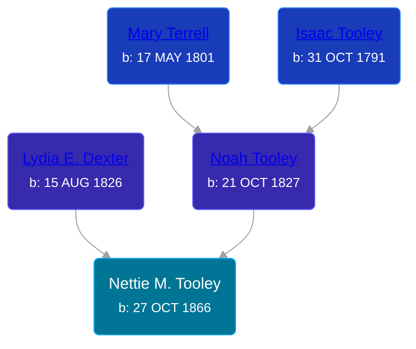

## 🟣 Nettie M. Tooley
<small>Age: 39y, 9m, 21d</small>

Daughter of [Noah Tooley](/people/8/84640933) and [Lydia E. Dexter](/people/6/67357568)





### 📆 Events


Type | Date | Age at Event | Place
------ | ------ | ------ | ------
Birth | 27 OCT 1866 |  |
[Residence](#event-event-0) | 12 AUG 1870 | 3y, 9m, 15d | Paris Township, Kent, Michigan, USA
[Residence](#event-event-1) | 1880 | 13y, 1m, 3d | Paris Township, Kent, Michigan, USA
[Death](#event-event-5) | 18 AUG 1906 | 39y, 9m, 21d | Paris Township, Kent, Michigan, USA
Burial |  |  | Oak Grove Cemetery, Paris Township, Kent, Michigan, USA



- **Birth**
**Date**: 27 OCT 1866, Age:
**Place**:
- **[Residence](#event-event-0)**
**Date**: 12 AUG 1870, Age: 3y, 9m, 15d
**Place**: Paris Township, Kent, Michigan, USA
- **[Residence](#event-event-1)**
**Date**: 1880, Age: 13y, 1m, 3d
**Place**: Paris Township, Kent, Michigan, USA
- **[Death](#event-event-5)**
**Date**: 18 AUG 1906, Age: 39y, 9m, 21d
**Place**: Paris Township, Kent, Michigan, USA
- **Burial**
**Date**:
**Place**: Oak Grove Cemetery, Paris Township, Kent, Michigan, USA


### 📰 Event Sources

####  Residence, 12 AUG 1870
* 1870 US Census

####  Residence, 1880
* 1880 US Census

####  Death, 18 AUG 1906
* Michigan, Death Records, 1867-1950
>   
  > Name: Nettie Granger [Nettie Tooley]   
  > Gender: Female  
  > Age: 39  
  > Race: White  
  > Birth Year: 1866  
  > Death Date: 18 Aug 1906  
  > Death Place: Paris, Kent, Michigan, USA  
  > Father: Noah Tooley  
  > Mother: Lydia Tooley
