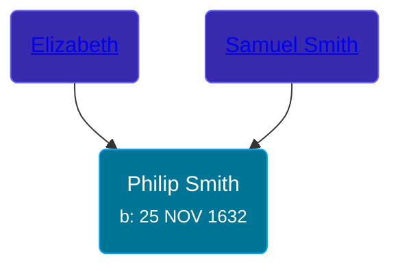

## 🔵 Philip Smith
<small>Age: 52y, 1m, 15d</small>

Son of [Samuel Smith](/people/8/86804391) and [Elizabeth ](/people/7/71389724)





### 📆 Events


Type | Date | Age at Event | Place
------ | ------ | ------ | ------
[Birth](#event-event-2) | 25 NOV 1632 |  | Ipswich, England
[Death](#event-event-3) | 10 JAN 1685 | 52y, 1m, 15d | Hadley, Massachusetts, USA



- **[Birth](#event-event-2)**
**Date**: 25 NOV 1632, Age:
**Place**: Ipswich, England
- **[Death](#event-event-3)**
**Date**: 10 JAN 1685, Age: 52y, 1m, 15d
**Place**: Hadley, Massachusetts, USA


## 👩‍❤️‍👨 Relationships

### 🟣 [Rebecca Foote](/people/3/32470572), b. 1634

#### Events


Type | Date | Age at Event | Place
------ | ------ | ------ | ------
[Marriage](#event-family-0-event-0) | Mar 1658 | 25y, 3m, 5d | Hadley, Massachusetts, USA



- **[Marriage](#event-family-0-event-0)**
**Date**: Mar 1658, Age: 25y, 3m, 5d
**Place**: Hadley, Massachusetts, USA


#### Children With Rebecca Foote
* 🔵 [Samuel Smith](/people/8/82805494), b. JAN 1658
* 🔵 [John Smith](/people/3/36040590), b. 18 DEC 1661
* 🔵 [Jonathan Smith](/people/8/86610734), b. 1663
* 🔵 [Philip Smith](/people/4/43477914), b. 1665
* 🟣 [Rebecca Smith](/people/7/76162584), b. 05 AUG 1669
* 🔵 [Nathaniel Smith](/people/8/82150350), b. 02 JAN 1671
* 🔵 [Joseph Smith](/people/4/405860), b. 1674
* 🔵 [Ichabod Smith](/people/3/31008221), b. 11 APR 1676
### 📰 Event Sources

####  Birth, 25 NOV 1632
* History of the Town of Sunderland, Massachusetts  - 532
* Ancestry of George W. Bush

####  Marriage, Mar 1658
* The Foote Family: or the Descendants of Nathaniel Foote  - 276
* Ancestry of George W. Bush
####  Death, 10 JAN 1685
* History of the Town of Sunderland, Massachusetts  - 533
* The Foote Family: or the Descendants of Nathaniel Foote  - 276
* Ancestry of George W. Bush
