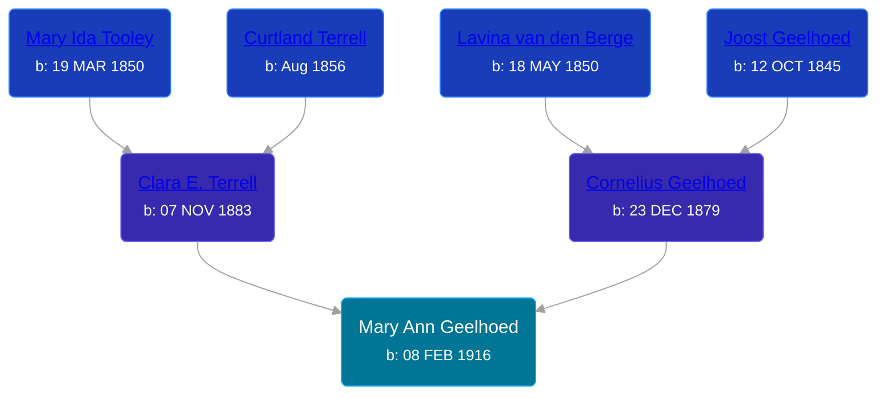

## 🟣 Mary Ann Geelhoed
<small>Age: 64y, 5m, 17d</small>

Daughter of [Cornelius Geelhoed](/people/9/92844960) and [Clara E. Terrell](/people/6/62490094)





### 📆 Events


Type | Date | Age at Event | Place
------ | ------ | ------ | ------
Birth | 08 FEB 1916 |  |
[Residence](#event-event-0) | 1920 | 3y, 9m, 22d | Paris Township, Kent, Michigan, USA
[Residence](#event-event-1) | 1930 | 13y, 9m, 22d | Cascade, Kent, Michigan, USA
[Death](#event-event-5) | 25 JUL 1980 | 64y, 5m, 17d | Grand Rapids, Kent, Michigan, United States
Burial | 28 JUL 1980 | 64y, 5m, 20d | Oakwood Cemetery, Lowell, Kent, Michigan, USA



- **Birth**
**Date**: 08 FEB 1916, Age:
**Place**:
- **[Residence](#event-event-0)**
**Date**: 1920, Age: 3y, 9m, 22d
**Place**: Paris Township, Kent, Michigan, USA
- **[Residence](#event-event-1)**
**Date**: 1930, Age: 13y, 9m, 22d
**Place**: Cascade, Kent, Michigan, USA
- **[Death](#event-event-5)**
**Date**: 25 JUL 1980, Age: 64y, 5m, 17d
**Place**: Grand Rapids, Kent, Michigan, United States
- **Burial**
**Date**: 28 JUL 1980, Age: 64y, 5m, 20d
**Place**: Oakwood Cemetery, Lowell, Kent, Michigan, USA


### 📰 Event Sources

####  Residence, 1920
* 1920 US Census

####  Residence, 1930
* 1930 US Census

####  Death, 25 JUL 1980
* Michigan Deaths, 1971-1996
>   
  > Name:  Mary A Lipps  
  > Birth Date: 8 Feb 1916  
  > Death Date: 25 Jul 1980  
  > Gender: Female  
  > Residence: Lowell, Kent, Michigan  
  > Place of Death: Grand Rapids, Kent, Michigan
* The Grand Rapids Press  - 25 Jul 1980
>   
  > LIPPS -- Mary Ann Lipps, aged 64, of Lowell, passed away Friday morning. She is survived by her children, Mrs. Harold (Shirley) Carigon, RonRaymor and Mrs. Al (Sandy) Roe all of Lowell; her brothers, Joseph Geelhoed of Ada, Cornelius and Raymond Geelhoed of Lowell; her sisters, Mrs. Ida Postma of Grand Rapids, Mrs. Katherine Fox of Ada, Mrs. Ella Thompson and Mrs. Cora Tefft of Lowell; seven grandchildren and one great grandchild. Funeral services will be Monday 1pm at the funeral home, with Re. Gerald R. Bates of the First Methodist Church officiating.Interment Oakwood Cemetery.
* U.S., Social Security Death Index, 1935-2014
>   
  > Name: MARY LIPPS  
  > Birth: 08 Feb 1916  
  > Death: Jul 1980  
  > Last Residence: 49331 (Lowell, Kent, MI)  
  > Last Benefit: 49331 (Lowell, Kent, MI)  
  > SSN: ###-##-####  
  > Issued: Michigan
