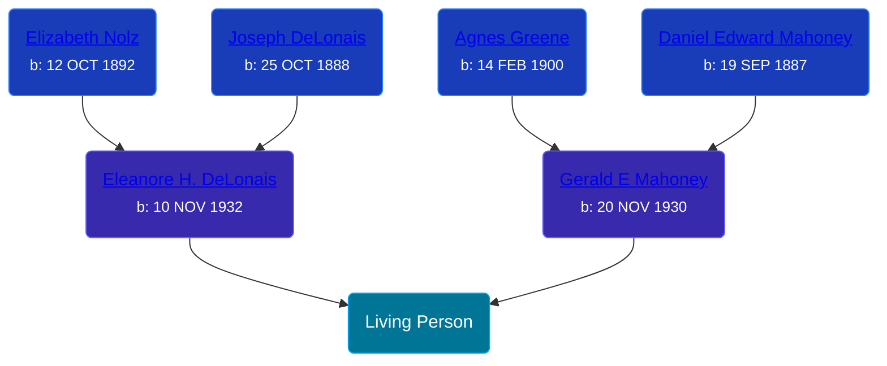

## 🟣 Living Person

Daughter of [Gerald E Mahoney](/people/1/10062624) and [Eleanore H. DeLonais](/people/4/45463626)





## 👩‍❤️‍👨 Relationships

### 🔵 [Living Person](/people/9/92212432)

#### Children With Living Person
* 🟣 [Living Person](/people/4/44831850)
* 🟣 [Living Person](/people/6/60380502)