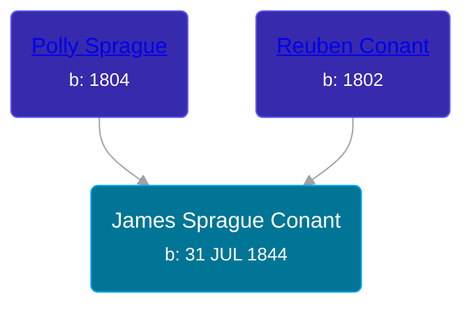

## 🔵 James Sprague Conant
<small>Age: 67y, 4m, 13d</small>

Son of [Reuben Conant](/people/7/72221832) and [Polly Sprague](/people/5/53927626)





### 📆 Events


Type | Date | Age at Event | Place
------ | ------ | ------ | ------
Birth | 31 JUL 1844 |  | New York, USA
[Residence](#event-event-0) | 30 SEP 1850 | 6y, 1m, 29d | Savannah, Wayne, New York, USA
[Residence](#event-event-1) | 06 JUL 1860 | 15y, 11m, 5d | Savannah, Wayne, New York, USA
[Residence](#event-event-2) | 1880 | 35y, 4m, -1d | Robinson Township, Ottawa, Michigan, USA
[Residence](#event-event-3) | 1900 | 55y, 4m, -1d | Robinson Township, Ottawa, Michigan, USA
[Residence](#event-event-4) | 1910 | 65y, 4m, -1d | Robinson Township, Ottawa, Michigan, USA
[Death](#event-event-8) | 14 DEC 1911 | 67y, 4m, 13d | Robinson Township, Ottawa, Michigan, USA
[Burial](#event-event-9) |  |  | Robinson Township Cemetery, Robinson Township, Ottawa, Michigan, USA



- **Birth**
**Date**: 31 JUL 1844, Age:
**Place**: New York, USA
- **[Residence](#event-event-0)**
**Date**: 30 SEP 1850, Age: 6y, 1m, 29d
**Place**: Savannah, Wayne, New York, USA
- **[Residence](#event-event-1)**
**Date**: 06 JUL 1860, Age: 15y, 11m, 5d
**Place**: Savannah, Wayne, New York, USA
- **[Residence](#event-event-2)**
**Date**: 1880, Age: 35y, 4m, -1d
**Place**: Robinson Township, Ottawa, Michigan, USA
- **[Residence](#event-event-3)**
**Date**: 1900, Age: 55y, 4m, -1d
**Place**: Robinson Township, Ottawa, Michigan, USA
- **[Residence](#event-event-4)**
**Date**: 1910, Age: 65y, 4m, -1d
**Place**: Robinson Township, Ottawa, Michigan, USA
- **[Death](#event-event-8)**
**Date**: 14 DEC 1911, Age: 67y, 4m, 13d
**Place**: Robinson Township, Ottawa, Michigan, USA
- **[Burial](#event-event-9)**
**Date**:
**Place**: Robinson Township Cemetery, Robinson Township, Ottawa, Michigan, USA


## 👩‍❤️‍👨 Relationships

### 🟣 [Katherine E. Murry](/people/2/25746290), b. 11 JUN 1848

#### Children With Katherine E. Murry
* 🟣 [Sylvia Mabel Conant](/people/8/88275832), b. 11 JUN 1867
* 🔵 [John M. Conant](/people/3/38989658), b. about 1870
* 🟣 [Mary Conant](/people/9/9630521), b. about 1873
* 🔵 [Fredrick J. Conant](/people/8/80092500), b. Oct 1874
* 🔵 [Edwin E. Conant](/people/9/92758405), b. 21 AUG 1878
* 🟣 [Anna M. Conant](/people/3/39387550), b. Jun 1883
* 🟣 [Myrtle Conant](/people/5/54992094), b. Nov 1886
### 📰 Event Sources

####  Residence, 30 SEP 1850
* 1850 US Census

####  Residence, 06 JUL 1860
* 1860 US Census

####  Residence, 1880
* 1880 US Census

####  Residence, 1900
* 1900 US Census

####  Residence, 1910
* 1910 US Census

####  Death, 14 DEC 1911
* Michigan, Death Records, 1867-1950
>   
  > Name:James Conant  
  > Gender:Male  
  > Race:White  
  > Marital status:Widowed  
  > Death Age:67  
  > Birth Date:31 Jul 1844  
  > Birth Place:New York City  
  > Death Date:14 Dec 1911  
  > Death Place:Robinson, Ottawa, Michigan, USA  
  > Father:Ruben Conant

####  Burial
* Robinson Township Cemetery
>   
  > Conant, James, Father  
  > b: 1844; d: 1911
