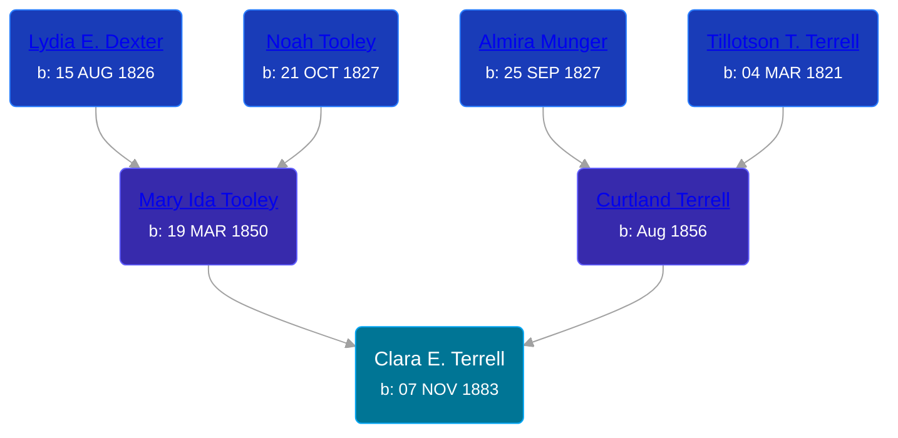

## 🟣 Clara E. Terrell
<small>Age: 77y, 5m, 26d</small>

Daughter of [Curtland Terrell](/people/4/47972604) and [Mary Ida Tooley](/people/5/52009861)





### 📆 Events


Type | Date | Age at Event | Place
------ | ------ | ------ | ------
Birth | 07 NOV 1883 |  | Paris Township, Kent, Michigan, USA
[Residence](#event-event-0) | 23 JUN 1884 | 7m, 16d | Paris Township, Kent, Michigan, USA
[Residence](#event-event-1) | 1894 | 10y, 23d | Paris Township, Kent, Michigan, USA
[Residence](#event-event-2) | 1900 | 16y, 23d | Paris Township, Kent, Michigan, USA
Residence | 22 APR 1910 | 26y, 5m, 15d | Paris Township, Kent, Michigan, USA
[Residence](#event-event-4) | 1920 | 36y, 23d | Paris Township, Kent, Michigan, USA
[Residence](#event-event-5) | 1930 | 46y, 23d | Cascade, Kent, Michigan, USA
[Residence](#event-event-6) | 12 APR 1940 | 56y, 5m, 5d | Algoma Township, Kent, Michigan, USA
[Death](#event-event-11) | 03 MAY 1961 | 77y, 5m, 26d | Grand Rapids, Kent, Michigan, United States
[Burial](#event-event-12) | 06 MAY 1961 | 77y, 5m, 29d | Pine Hill Cemetery, Kentwood, Kent, Michigan, USA



- **Birth**
**Date**: 07 NOV 1883, Age:
**Place**: Paris Township, Kent, Michigan, USA
- **[Residence](#event-event-0)**
**Date**: 23 JUN 1884, Age: 7m, 16d
**Place**: Paris Township, Kent, Michigan, USA
- **[Residence](#event-event-1)**
**Date**: 1894, Age: 10y, 23d
**Place**: Paris Township, Kent, Michigan, USA
- **[Residence](#event-event-2)**
**Date**: 1900, Age: 16y, 23d
**Place**: Paris Township, Kent, Michigan, USA
- **Residence**
**Date**: 22 APR 1910, Age: 26y, 5m, 15d
**Place**: Paris Township, Kent, Michigan, USA
- **[Residence](#event-event-4)**
**Date**: 1920, Age: 36y, 23d
**Place**: Paris Township, Kent, Michigan, USA
- **[Residence](#event-event-5)**
**Date**: 1930, Age: 46y, 23d
**Place**: Cascade, Kent, Michigan, USA
- **[Residence](#event-event-6)**
**Date**: 12 APR 1940, Age: 56y, 5m, 5d
**Place**: Algoma Township, Kent, Michigan, USA
- **[Death](#event-event-11)**
**Date**: 03 MAY 1961, Age: 77y, 5m, 26d
**Place**: Grand Rapids, Kent, Michigan, United States
- **[Burial](#event-event-12)**
**Date**: 06 MAY 1961, Age: 77y, 5m, 29d
**Place**: Pine Hill Cemetery, Kentwood, Kent, Michigan, USA


## 👩‍❤️‍👨 Relationships

### 🔵 [Cornelius Geelhoed](/people/9/92844960), b. 23 DEC 1879

#### Events


Type | Date | Age at Event | Place
------ | ------ | ------ | ------
[Marriage](#event-family-0-event-0) | 06 AUG 1903 | 19y, 8m, 29d | Grand Rapids, Kent, Michigan, United States



- **[Marriage](#event-family-0-event-0)**
**Date**: 06 AUG 1903, Age: 19y, 8m, 29d
**Place**: Grand Rapids, Kent, Michigan, United States


#### Children With Cornelius Geelhoed
* 🟣 [Lavina Geelhoed](/people/6/61172656), b. 01 DEC 1905
* 🟣 [Ida Mary Geelhoed](/people/1/11612484), b. 18 DEC 1907
* 🟣 [Katherine Geelhoed](/people/9/97434011), b. 02 JUN 1910
* 🔵 [Joseph Geelhoed](/people/1/15410559), b. 26 NOV 1912
* 🟣 [Mary Ann Geelhoed](/people/6/6202111), b. 08 FEB 1916
* 🟣 [Ella May Geelhoed](/people/7/77129056), b. 12 OCT 1918
* 🔵 [Cora L. Geelhoed](/people/9/92397342), b. 13 MAR 1921
* 🔵 [Cornelius Geelhoed](/people/7/7469384), b. 07 MAR 1923
* 🔵 [Raymond Geelhoed](/people/9/98188250), b. 30 DEC 1924
### 📰 Event Sources

####  Residence, 23 JUN 1884
* 1884 Michigan State Census

####  Residence, 1894
* 1894 Michigan State Census

####  Residence, 1900
* 1900 US Census

####  Marriage, 06 AUG 1903
* Kent County Marriage Records  - Book 13, Page 267, Record 3885
>   
  > Date of Record: 6 Aug 1903  
  > Date of Marriage: 6 Aug 1903  
  > Place of Marriage: Grand Rapids, Kent County, Michigan  
  > Groom: Cornelius Geelhood  
  > Bride: Clara Terrell  
  > Groom's Birthplace: Netherlands  
  > Groom's Parents: Joe Geelhoed and S. Vandenberg  
  > Groom's Prev. Marriages: 0  
  > Bride's Birthplace: Paris Township, Kent County, Michigan  
  > Bride's Parents: K. Terrell and Unknown  
  > Bride's Prev. Marriages: 0

####  Residence, 1920
* 1920 US Census

####  Residence, 1930
* 1930 US Census

####  Residence, 12 APR 1940
* 1940 US Census

####  Death, 03 MAY 1961
* The Grand Rapids Press  - 4 May 1961
>   
  > GEELHOOD -- Mrs. Clara E. Geelhood, aged 77, of Rte. 3 Lowell, former resident of Paris Township, passed away Wednesday evening at Sunshine Hospital. She is survived by three sons, Joseph, Cornelius Jr. and Raymond; five daughters, Mrs. Martin (Ida) Postma, Mrs. Kenneth (Katheirne) Fox, all of Grand Rapids, Mrs. Mary Ann Raymor, Mrs. Roy (Ella) Thompson, both of Lowell, Mrs. Burt (Cora) Tefft of Belding; one brother,Arthur Terrell of Sparta; 28 grandchildren; 28 great-grandchildren and several nieces and nephews. Mrs. Geelhood reposes at the Vanderpool Chapel of Godwin Heights, 3131 S. Division, where funderal services will be held Saturday at 2 pm, with Reverend S. H. Houholt, Pastor of Good News Baptist Church, officiating. Burial at Pine Hill Cemetery.

####  Burial, 06 MAY 1961
* Pine Hill Cemetery, Personal Visit
>   
  > Terrell, Clara  
  > b: 1883; d: 1961
