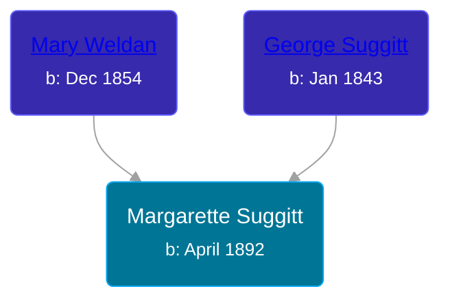

## 🟣 Margarette Suggitt

Daughter of [George Suggitt](/people/4/48171276) and [Mary Weldan](/people/1/18538354)





### 📆 Events


Type | Date | Age at Event | Place
------ | ------ | ------ | ------
Birth | April 1892 |  | Illinois, USA
[Residence](#event-event-0) | 08 JUN 1900 | 8y, 2m, 8d | Neponset, Bureau, Illinois, USA



- **Birth**
**Date**: April 1892, Age:
**Place**: Illinois, USA
- **[Residence](#event-event-0)**
**Date**: 08 JUN 1900, Age: 8y, 2m, 8d
**Place**: Neponset, Bureau, Illinois, USA


### 📰 Event Sources

####  Residence, 08 JUN 1900
* 1900 US Census
