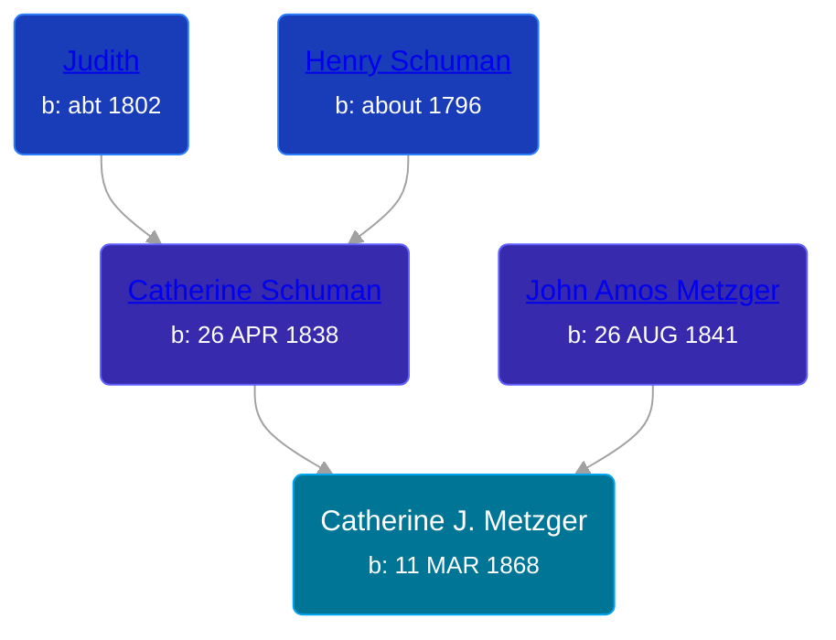

## 🟣 Catherine J. Metzger
<small>Age: 47y, 1m, 20d</small>

Daughter of [John Amos Metzger](/people/2/28893894) and [Catherine Schuman](/people/3/39599940)





### 📆 Events


Type | Date | Age at Event | Place
------ | ------ | ------ | ------
Birth | 11 MAR 1868 |  | Whitley, Indiana, USA
[Residence](#event-event-0) | 1870 | 1y, 8m, 19d | Troy Township, Whitley, Indiana, USA
[Residence](#event-event-1) | 1880 | 11y, 8m, 19d | Richland, Whitley, Indiana, USA
[Death](#event-event-5) | 01 MAY 1915 | 47y, 1m, 20d | Larwill, Whitley, Indiana, USA



- **Birth**
**Date**: 11 MAR 1868, Age:
**Place**: Whitley, Indiana, USA
- **[Residence](#event-event-0)**
**Date**: 1870, Age: 1y, 8m, 19d
**Place**: Troy Township, Whitley, Indiana, USA
- **[Residence](#event-event-1)**
**Date**: 1880, Age: 11y, 8m, 19d
**Place**: Richland, Whitley, Indiana, USA
- **[Death](#event-event-5)**
**Date**: 01 MAY 1915, Age: 47y, 1m, 20d
**Place**: Larwill, Whitley, Indiana, USA


## 👩‍❤️‍👨 Relationships

### 🔵 [Henry Mathias](/people/2/25073708)

#### Children With Henry Mathias
* 🟣 [Living Person](/people/4/46792012)
* 🟣 [Anna Marie Mathias](/people/5/50075230), b. about 1895
### 📰 Event Sources

####  Residence, 1870
* 1870 US Census

####  Residence, 1880
* 1880 US Census

####  Death, 01 MAY 1915
* Indiana, Death Certificates, 1899-2011
>   
  > Name:Mrs Katie J. Mathias  
  > [Mrs Katie J. Metzger]   
  > Gender:Female  
  > Race:White  
  > Age:47  
  > Birth Date:11 Mar 1868  
  > Birth Place:Whitley Co Ind  
  > Death Date:1 May 1915  
  > Death Place:Larwill, Whitley, Indiana, USA  
  > Marital Status:Married  
  > Father:John A. Metzger  
  > Mother:K. Schuman
