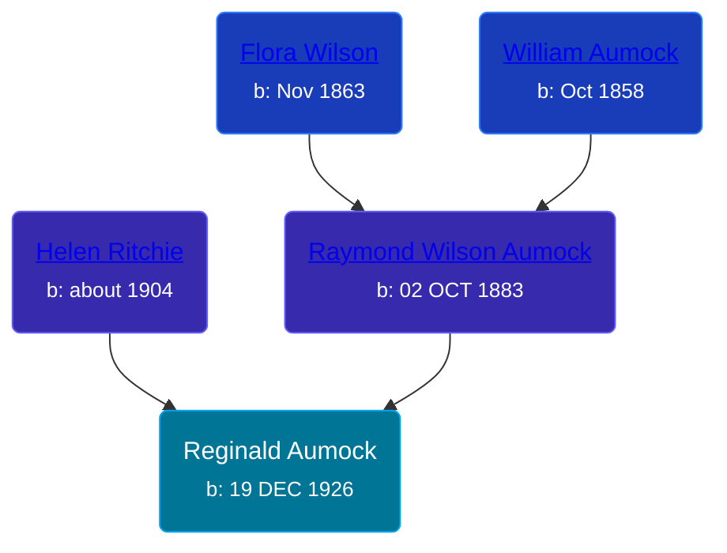

## 🔵 Reginald Aumock
<small>Age: 70y, 3m, 8d</small>

Son of [Raymond Wilson Aumock](/people/1/17962037) and [Helen Ritchie](/people/8/88758866)





### 📆 Events


Type | Date | Age at Event | Place
------ | ------ | ------ | ------
Birth | 19 DEC 1926 |  |
[Residence](#event-event-0) | 28 APR 1930 | 3y, 4m, 9d | Detroit, Wayne, Michigan, USA
[Residence](#event-event-1) | 12 APR 1940 | 13y, 3m, 23d | Detroit, Wayne, Michigan, USA
[Death](#event-event-5) | 27 MAR 1997 | 70y, 3m, 8d |



- **Birth**
**Date**: 19 DEC 1926, Age:
**Place**:
- **[Residence](#event-event-0)**
**Date**: 28 APR 1930, Age: 3y, 4m, 9d
**Place**: Detroit, Wayne, Michigan, USA
- **[Residence](#event-event-1)**
**Date**: 12 APR 1940, Age: 13y, 3m, 23d
**Place**: Detroit, Wayne, Michigan, USA
- **[Death](#event-event-5)**
**Date**: 27 MAR 1997, Age: 70y, 3m, 8d
**Place**:


## 👩‍❤️‍👨 Relationships

### 🟣 [Living Person](/people/8/87693036)

### 📰 Event Sources

####  Residence, 28 APR 1930
* 1930 US Census

####  Residence, 12 APR 1940
* 1940 US Census

####  Death, 27 MAR 1997
* U.S., Social Security Death Index, 1935-2014
