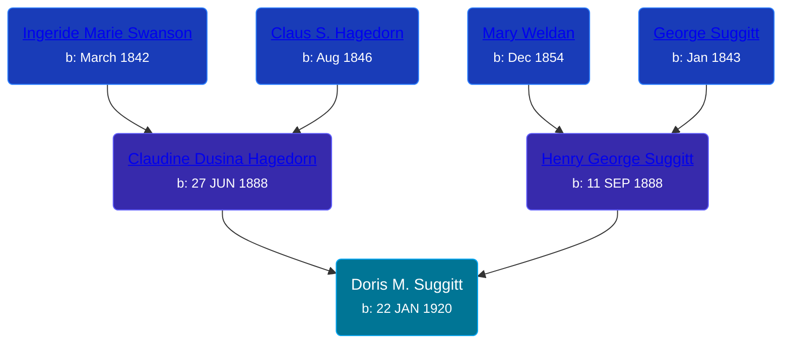

## 🟣 Doris M. Suggitt
<small>Age: 78y, 10m, 12d</small>

Daughter of [Henry George Suggitt](/people/7/7271894) and [Claudine Dusina Hagedorn](/people/2/21896640)





### 📆 Events


Type | Date | Age at Event | Place
------ | ------ | ------ | ------
Birth | 22 JAN 1920 |  | Royal Town, Clay, Iowa, USA
[Residence](#event-event-0) | 01 JAN 1925 | 4y, 11m, 9d | Lincoln, Clay, Iowa, USA
[Residence](#event-event-1) | 09 APR 1930 | 10y, 2m, 17d | Royal Town, Clay, Iowa, USA
[Death](#event-event-5) | 04 DEC 1998 | 78y, 10m, 12d | Sioux City, Woodbury, Iowa, USA



- **Birth**
**Date**: 22 JAN 1920, Age:
**Place**: Royal Town, Clay, Iowa, USA
- **[Residence](#event-event-0)**
**Date**: 01 JAN 1925, Age: 4y, 11m, 9d
**Place**: Lincoln, Clay, Iowa, USA
- **[Residence](#event-event-1)**
**Date**: 09 APR 1930, Age: 10y, 2m, 17d
**Place**: Royal Town, Clay, Iowa, USA
- **[Death](#event-event-5)**
**Date**: 04 DEC 1998, Age: 78y, 10m, 12d
**Place**: Sioux City, Woodbury, Iowa, USA


## 👩‍❤️‍👨 Relationships

### 🔵 [Living Person](/people/5/5859459)

#### Children With Living Person
* 🔵 [Living Person](/people/2/2748872)
* 🟣 [Living Person](/people/4/48466912)
* 🟣 [Living Person](/people/1/142686)
* 🔵 [Living Person](/people/3/3797473)
* 🔵 [Living Person](/people/4/40312972)
### 🔵 [George M. Beacom](/people/5/53193608)

#### Events


Type | Date | Age at Event | Place
------ | ------ | ------ | ------
Marriage | 1954 | 33y, 10m, 8d | Elk Point



- **Marriage**
**Date**: 1954, Age: 33y, 10m, 8d
**Place**: Elk Point


#### Children With George M. Beacom
* 🔵 [Living Person](/people/1/18778048)
### 📰 Event Sources

####  Residence, 01 JAN 1925
* 1925 Iowa State Census

####  Residence, 09 APR 1930
* 1930 US Census

####  Marriage, 1954

####  Death, 04 DEC 1998
* Sioux City Journal
>   
  > Doris M. Beacom  
  > Doris M. Beacom, 78, of Sioux City died Friday, Dec. 4, 1998 at a Sioux City hospital.  
  >   
  > Services will be 2 p.m. Sunday, Dec. 20, 1998 at Trinity Lutheran Church with the Rev. Dr. John Meyer and the Rev. Kathy Wicks officiating. The body was cremated. Burial will be in Calvary Cemetery. Nelson-Berger Northside Chapel is in charge of arrangements.  
  >   
  > Mrs. Beacom was born Jan. 22, 1920 in Royal, Iowa the daughter of Henry George and Clauden D. (Hagedorn) Suggitt. She attended Sioux City Central High School. She received her Bachelor of Science degree from Morningside College in 1973 and her Masters from the University of Iowa in 1981. She was employed as a social worker for the State of Iowa. Prior to that, she operated Chubs Grocery.  
  >   
  > She married Swen Anderson June 29, 1938 in Le Mars, Iowa.  
  >   
  > She married George Beacom in 1954 in Elk Point, S.D. He died in 1957.  
  >   
  > She was a member of Trinity Lutheran Church. She was a member of Alcoholics Anonymous. She helped Gov. Harold Hughes start the program, I.C.A.P. for the State of Iowa. She was a co-founder of Siouxland Council on Alcoholism.  
  >   
  > Survivors include three sons and their wives, Wyman and Ethelmaye Anderson of Sioux City and Bill and Linda Anderson and Joseph and Roxann Beacom all of Phoenix, Ariz.; one daughter, Karen Anderson of Hawthorne, Calif.; one brother, Arley and his wife Jenice of Sioux City; four grandchildren Cheryl, Debra, Erik and Kristen and two great-grandchildren.  
  >   
  > She was preceded in death by one son, Tom and one daughter, Dorothy Ann Anderson and two sisters Irma Moss and Vivian Hogan.