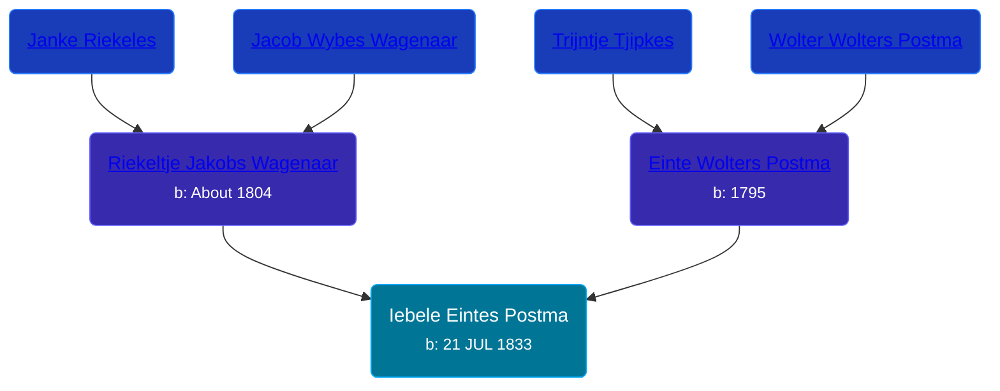

## 🔵 Iebele Eintes Postma

Son of [Einte Wolters Postma](/people/1/18880768) and [Riekeltje Jakobs Wagenaar](/people/7/77820694)





### 📆 Events


Type | Date | Age at Event | Place
------ | ------ | ------ | ------
[Birth](#event-event-2) | 21 JUL 1833 |  | Achtkarspelen, Netherlands



- **[Birth](#event-event-2)**
**Date**: 21 JUL 1833, Age:
**Place**: Achtkarspelen, Netherlands


## 👩‍❤️‍👨 Relationships

### 🟣 [Roelfke Bonnema](/people/6/6778152), b. about 1837

#### Events


Type | Date | Age at Event | Place
------ | ------ | ------ | ------
[Marriage](#event-family-0-event-0) | 26 APR 1862 | 28y, 9m, 5d | Leek, Netherlands



- **[Marriage](#event-family-0-event-0)**
**Date**: 26 APR 1862, Age: 28y, 9m, 5d
**Place**: Leek, Netherlands


### 📰 Event Sources

####  Birth, 21 JUL 1833
* Dutch Civil Register
>   
  > Source Civil register - Birth  
  > Archive location: Tresoar, Frysk Histoarysk en Letterkundich Sintrum  
  > General Municipality: Achtkarspelen  
  > Type of record: Geboorteakte  
  > Record number: B 60  
  > Registration date: 23-07-1833  
  > Child: Iebele Eintes Postma  
  > Gender: M  
  > Date of birth: 21-07-1833  
  > Father: Einte Wolters Postma  
  > Mother: Riekeltje Jakobs Wagenaar
####  Marriage, 26 APR 1862
* Dutch Civil Register
>   
  > Groom: Iebele Eintes Postma  
  > Profession (Groom): boerenknecht  
  > Place of birth (Groom): Surhuisterveen  
  > Age (Groom): 28 jaar  
  >   
  > Bride: Roelfke Bonnema  
  > Profession (Bride): Arbeidster  
  > Place of birth (Bride): Tolbert  
  > Age (Bride): 25 jaar  
  >   
  > Father of the groom: Einte Wolters Postma  
  > Profession (Father of the groom): arbeider  
  >   
  > Mother of the groom: Riekeltje Jakobs Wagenaar  
  > Profession (Mother of the groom): Arbeidster  
  >   
  > Father of the bride: Auwe Lammerts Bonnema  
  > Profession (Father of the bride): Arbeidster  
  >   
  > Mother of the bride: Grietje Jakobs Auwema  
  >   
  > Event: Huwelijk  
  > Event date: 26-04-1862  
  > Event place: Leek  
  >   
  > Document type: BS Huwelijk  
  > Heritage institution: Groninger Archieven  
  > Institution place: Groningen  
  > Collection region: Groningen  
  > Source number: 13  
  > Registration date: 26-04-1862  
  > Document place: Leek  
  > Collection: Bron: boek, Periode: 1862  
  > Book: Huwelijksregister 1862  
  > AkteSoort: huwelijk  
  >
