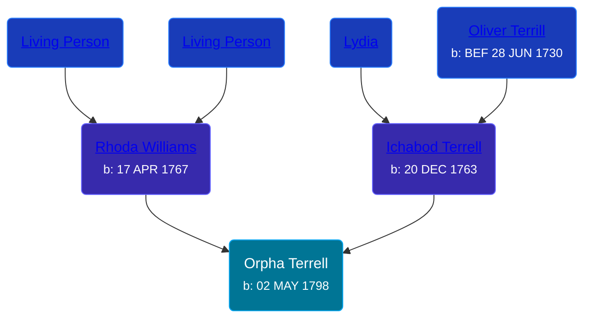

## 🟣 Orpha Terrell

Daughter of [Ichabod Terrell](/people/6/66420816) and [Rhoda Williams](/people/2/220352)





### 📆 Events


Type | Date | Age at Event | Place
------ | ------ | ------ | ------
[Birth](#event-event-2) | 02 MAY 1798 |  |



- **[Birth](#event-event-2)**
**Date**: 02 MAY 1798, Age:
**Place**:


### 📰 Event Sources

####  Birth, 02 MAY 1798
* The Town and City of Waterbury, Connecticut  - 135
* Roger and Abigail (Ufford) Terrill and Some Descendants: 1632 - 1993  - 73