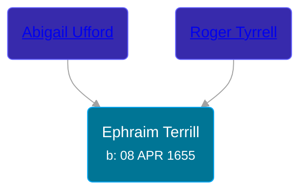

## 🔵 Ephraim Terrill

Son of [Roger Tyrrell](/people/2/2108514) and [Abigail Ufford](/people/9/99473444)





### 📆 Events


Type | Date | Age at Event | Place
------ | ------ | ------ | ------
[Birth](#event-event-2) | 08 APR 1655 |  |



- **[Birth](#event-event-2)**
**Date**: 08 APR 1655, Age:
**Place**:


### 📰 Event Sources

####  Birth, 08 APR 1655
* Roger and Abigail (Ufford) Terrill and Some Descendants: 1632 - 1993  - 6