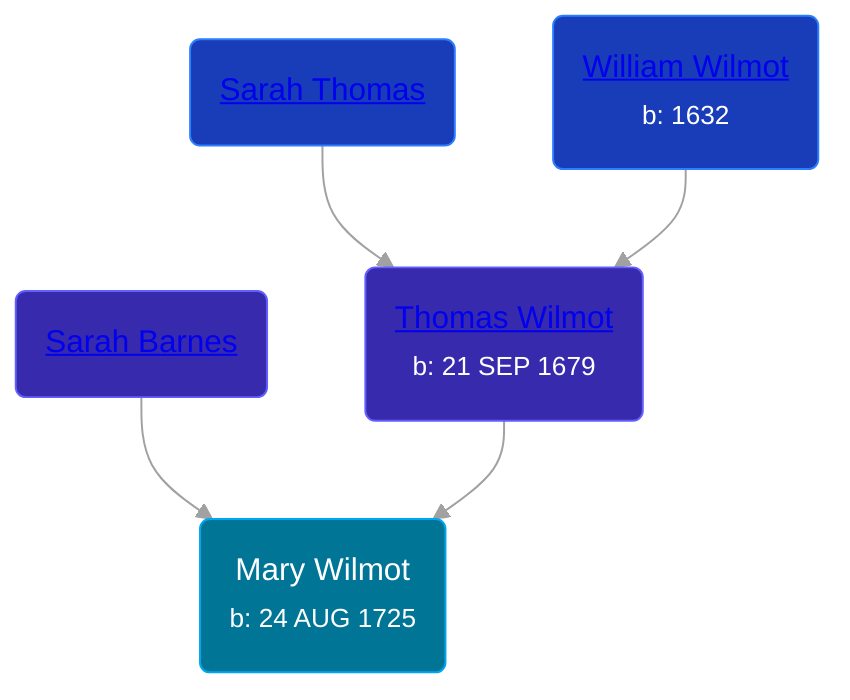

## 🟣 Mary Wilmot

Daughter of [Thomas Wilmot](/people/3/36930663) and [Sarah Barnes](/people/6/642264)





### 📆 Events


Type | Date | Age at Event | Place
------ | ------ | ------ | ------
[Birth](#event-event-2) | 24 AUG 1725 |  |



- **[Birth](#event-event-2)**
**Date**: 24 AUG 1725, Age:
**Place**:


### 📰 Event Sources

####  Birth, 24 AUG 1725
* The New England Historical and Genealogical Register  - 71