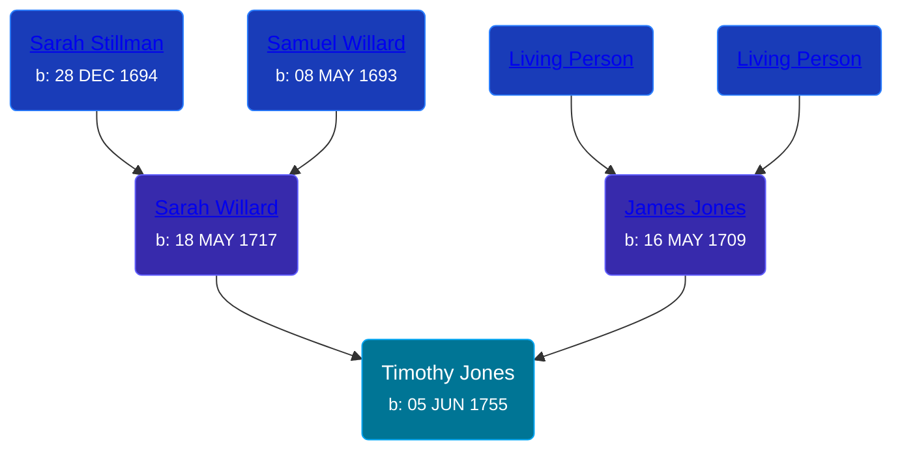

## 🔵 Timothy Jones

Son of [James Jones](/people/6/61233476) and [Sarah Willard](/people/2/24374592)





### 📆 Events


Type | Date | Age at Event | Place
------ | ------ | ------ | ------
[Birth](#event-event-2) | 05 JUN 1755 |  |



- **[Birth](#event-event-2)**
**Date**: 05 JUN 1755, Age:
**Place**:


### 📰 Event Sources

####  Birth, 05 JUN 1755
* The New England Historical and Genealogical Register  - 313