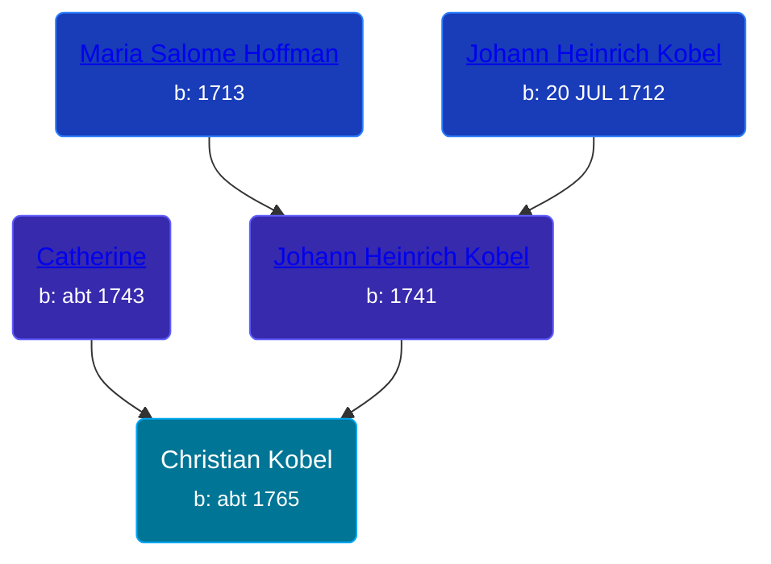

## 🔵 Christian Kobel
<small>Age: 65y, 10m, 4d</small>

Son of [Johann Heinrich Kobel](/people/6/65601892) and [Catherine ](/people/6/61051648)





### 📆 Events


Type | Date | Age at Event | Place
------ | ------ | ------ | ------
Birth | abt 1765 |  | Bethel Township, Berks, Pennsylvania, USA
Death | 04 OCT 1830 | 65y, 10m, 4d | Wayne, Ohio, USA
[Burial](#event-event-4) |  |  | Salem Lutheran Cemetery, Madisonburg, Wayne, Ohio, USA



- **Birth**
**Date**: abt 1765, Age:
**Place**: Bethel Township, Berks, Pennsylvania, USA
- **Death**
**Date**: 04 OCT 1830, Age: 65y, 10m, 4d
**Place**: Wayne, Ohio, USA
- **[Burial](#event-event-4)**
**Date**:
**Place**: Salem Lutheran Cemetery, Madisonburg, Wayne, Ohio, USA


## 👩‍❤️‍👨 Relationships

### 🟣 [Catherine Roth](/people/8/85792165), b. 19 OCT 1765

#### Children With Catherine Roth
* 🔵 [Christian Kobel](/people/1/17423128), b. 20 JUN 1808
### 📰 Event Sources

####  Burial
* findagrave.com
