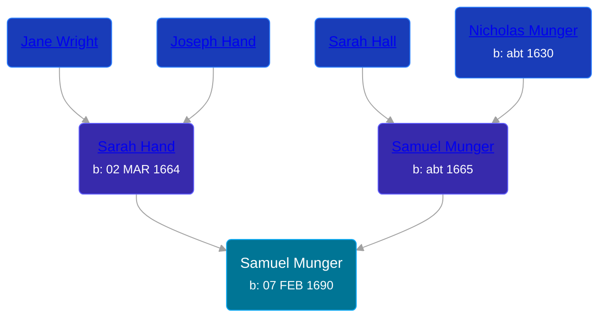

## 🔵 Samuel Munger
<small>Age: 38y, 2m, 23d</small>

Son of [Samuel Munger](/people/5/57362828) and [Sarah Hand](/people/7/75255100)





### 📆 Events


Type | Date | Age at Event | Place
------ | ------ | ------ | ------
[Birth](#event-event-2) | 07 FEB 1690 |  | Guilford, Connecticut, USA
[Death](#event-event-3) | May 1728 | 38y, 2m, 23d |



- **[Birth](#event-event-2)**
**Date**: 07 FEB 1690, Age:
**Place**: Guilford, Connecticut, USA
- **[Death](#event-event-3)**
**Date**: May 1728, Age: 38y, 2m, 23d
**Place**:


## 👩‍❤️‍👨 Relationships

### 🟣 [Dorothy Evarts](/people/5/59501816), b. 1686

#### Events


Type | Date | Age at Event | Place
------ | ------ | ------ | ------
[Marriage](#event-family-0-event-0) | 06 APR 1710 | 20y, 1m, 29d | Guilford, Connecticut, USA



- **[Marriage](#event-family-0-event-0)**
**Date**: 06 APR 1710, Age: 20y, 1m, 29d
**Place**: Guilford, Connecticut, USA


#### Children With Dorothy Evarts
* 🟣 [Living Person](/people/8/8047387)
* 🟣 [Living Person](/people/7/79164696)
* 🟣 [Submit Munger](/people/1/10597619), b. 05 JAN 1711
* 🔵 [Nathaniel Munger](/people/3/38968541), b. 05 OCT 1712
* 🔵 [Samuel Munger](/people/1/17676382), b. 05 OCT 1712
* 🔵 [Elnathan Munger](/people/3/39748505), b. 14 JUL 1714
* 🔵 [Joseph Munger](/people/4/48475708), b. JUL 1719
* 🟣 [Sarah Munger](/people/2/2457192), b. 1726
### 📰 Event Sources

####  Birth, 07 FEB 1690
* The Munger Book  - 203
* Families of Early Guilford, Connecticut, Vol. II  - 833, 835

####  Marriage, 06 APR 1710
* The Munger Book  - 203
####  Death, May 1728
* Families of Early Guilford, Connecticut, Vol. II  - 833, 835
