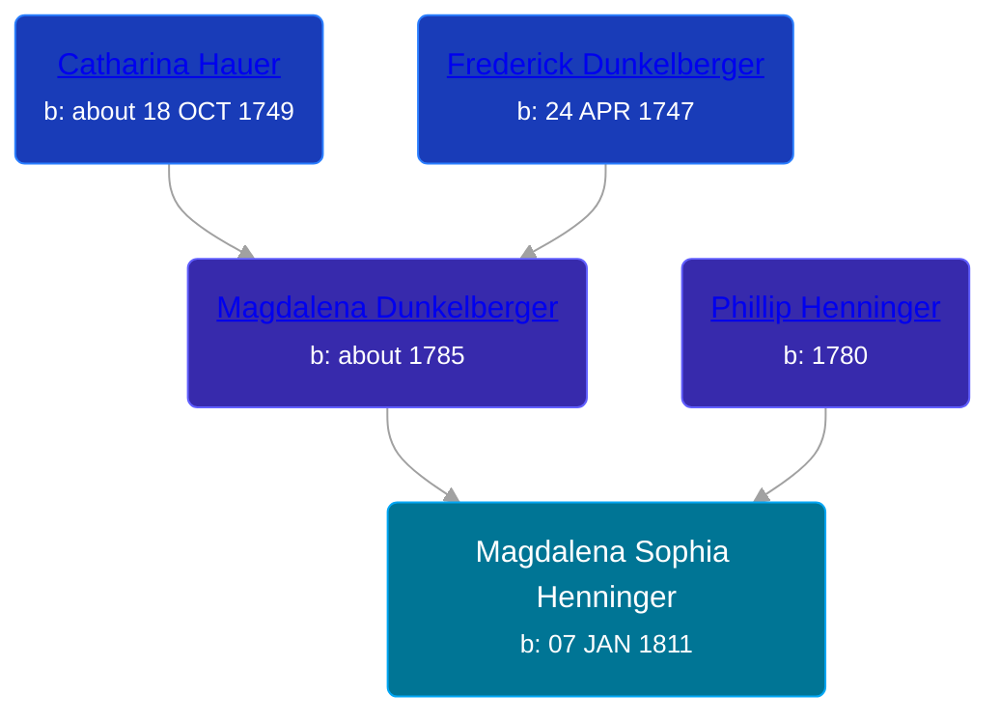

## 🟣 Magdalena Sophia Henninger
<small>Age: 33y, 3m, 12d</small>

Daughter of [Phillip Henninger](/people/6/69475448) and [Magdalena Dunkelberger](/people/9/94381550)





### 📆 Events


Type | Date | Age at Event | Place
------ | ------ | ------ | ------
[Birth](#event-event-3) | 07 JAN 1811 |  | Northumberland, Pennsylvania, USA
[Death](#event-event-4) | 19 APR 1844 | 33y, 3m, 12d | Wayne, Ohio, USA



- **[Birth](#event-event-3)**
**Date**: 07 JAN 1811, Age:
**Place**: Northumberland, Pennsylvania, USA
- **[Death](#event-event-4)**
**Date**: 19 APR 1844, Age: 33y, 3m, 12d
**Place**: Wayne, Ohio, USA


## 👩‍❤️‍👨 Relationships

### 🔵 [Christian Kobel](/people/1/17423128), b. 20 JUN 1808

#### Events


Type | Date | Age at Event | Place
------ | ------ | ------ | ------
[Marriage](#event-family-0-event-0) | 11 NOV 1830 | 19y, 10m, 4d | Wayne, Wayne, Ohio, USA



- **[Marriage](#event-family-0-event-0)**
**Date**: 11 NOV 1830, Age: 19y, 10m, 4d
**Place**: Wayne, Wayne, Ohio, USA


#### Children With Christian Kobel
* 🟣 [Sarah Ann Kobel](/people/4/45477428), b. 28 MAY 1832
* 🔵 [Kobel](/people/2/22427094), b. 12 FEB 1834
* 🔵 [Henry Kobel](/people/8/84112000), b. 19 MAR 1835
* 🔵 [Hyram Kobel](/people/3/34505322), b. 25 JAN 1838
* 🔵 [Joseph Kobel](/people/4/44694656), b. 06 JUL 1841
* 🟣 [Catherine Kobel](/people/7/73520945), b. 1843
* 🔵 [Charles Kobel](/people/1/10022372), b. abt 1843
### 📰 Event Sources

####  Birth, 07 JAN 1811
* Ron Wilson's Research

####  Marriage, 11 NOV 1830
* Ohio, County Marriages, 1774-1993
>   
  > Name: Magdelena Heninger  
  > Gender: Female  
  > Marriage Date: 11 Nov 1830  
  > Marriage Place: Wayne, Ohio, USA  
  > Spouse: Christian Koble  
  > Film Number: 000425753
####  Death, 19 APR 1844
* Ron Wilson's Research
