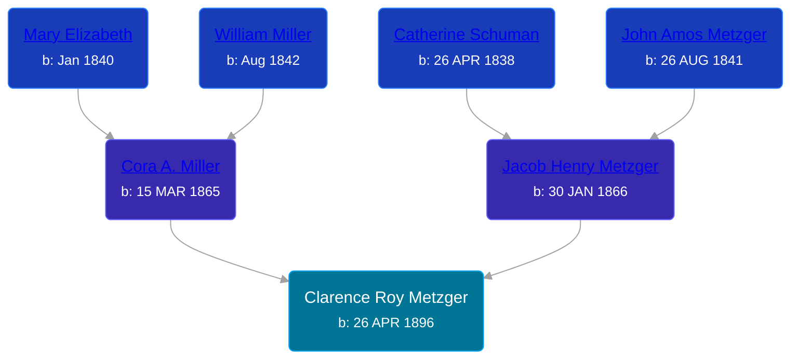

## 🔵 Clarence Roy Metzger
<small>Age: 65y, 7m, 4d</small>

Son of [Jacob Henry Metzger](/people/1/13773745) and [Cora A. Miller](/people/1/12053368)





### 📆 Events


Type | Date | Age at Event | Place
------ | ------ | ------ | ------
[Birth](#event-event-2) | 26 APR 1896 |  | Larwill, Whitley, Indiana, USA
[Residence](#event-event-0) | 21 JUN 1900 | 4y, 1m, 25d | Richland, Whitley, Indiana, USA
[Residence](#event-event-1) | 27 APR 1910 | 14y, 1d | Columbia, Whitley, Indiana, USA
[Residence](#event-event-2) | Jan 1920 | 23y, 8m, 4d | Columbia, Whitley, Indiana, USA
[Residence](#event-event-3) | 10 APR 1930 | 33y, 11m, 14d | Thorn Creek Township, Whitley, Indiana, USA
[Residence](#event-event-4) | 08 APR 1940 | 43y, 11m, 12d | Thorn Creek Township, Whitley, Indiana, USA
Death | 1962 | 65y, 7m, 4d |
[Burial](#event-event-9) |  |  | Stough Cemetery, Whitley, Indiana, USA



- **[Birth](#event-event-2)**
**Date**: 26 APR 1896, Age:
**Place**: Larwill, Whitley, Indiana, USA
- **[Residence](#event-event-0)**
**Date**: 21 JUN 1900, Age: 4y, 1m, 25d
**Place**: Richland, Whitley, Indiana, USA
- **[Residence](#event-event-1)**
**Date**: 27 APR 1910, Age: 14y, 1d
**Place**: Columbia, Whitley, Indiana, USA
- **[Residence](#event-event-2)**
**Date**: Jan 1920, Age: 23y, 8m, 4d
**Place**: Columbia, Whitley, Indiana, USA
- **[Residence](#event-event-3)**
**Date**: 10 APR 1930, Age: 33y, 11m, 14d
**Place**: Thorn Creek Township, Whitley, Indiana, USA
- **[Residence](#event-event-4)**
**Date**: 08 APR 1940, Age: 43y, 11m, 12d
**Place**: Thorn Creek Township, Whitley, Indiana, USA
- **Death**
**Date**: 1962, Age: 65y, 7m, 4d
**Place**:
- **[Burial](#event-event-9)**
**Date**:
**Place**: Stough Cemetery, Whitley, Indiana, USA


## 👩‍❤️‍👨 Relationships

### 🟣 [Laura Keirn](/people/5/5658632), b. 11 MAR 1898

#### Events


Type | Date | Age at Event | Place
------ | ------ | ------ | ------
[Marriage](#event-family-0-event-0) | 20 JUL 1916 | 20y, 2m, 24d | St. Joseph, Berrien, Michigan, USA



- **[Marriage](#event-family-0-event-0)**
**Date**: 20 JUL 1916, Age: 20y, 2m, 24d
**Place**: St. Joseph, Berrien, Michigan, USA


#### Children With Laura Keirn
* 🔵 [Living Person](/people/9/91456448)
* 🔵 [Living Person](/people/9/97320868)
* 🔵 [Living Person](/people/5/51872304)
### 📰 Event Sources

####  Birth, 26 APR 1896
* U.S., World War I Draft Registration Cards, 1917-1918  - Roll: 1653175

####  Residence, 21 JUN 1900
* 1900 US Census
>   
  > Name: Roy Metzger  
  > Age: 4  
  > Birth Date: Apr 1896  
  > Birthplace: Indiana, USA  
  > Home in 1900: Richland, Whitley, Indiana  
  > Sheet Number: 13  
  > Number of Dwelling in Order of Visitation: 293  
  > Family Number: 298  
  > Race: White  
  > Gender: Male  
  > Relation to Head of House: Son  
  > Marital Status: Single  
  > Father's Name: Jacob Metzger  
  > Father's Birthplace: Ohio, USA  
  > Mother's Name: Cora Metzger  
  > Mother's Birthplace: Indiana, USA

####  Residence, 27 APR 1910
* 1910 US Census
>   
  > Name: Clarence R Metzger  
  > Age in 1910: 14  
  > Birth Date: 1896  
  > Birthplace: Indiana  
  > Home in 1910: Columbia, Whitley, Indiana, USA  
  > Race: White  
  > Gender: Male  
  > Relation to Head of House: Son  
  > Marital Status: Single  
  > Father's Name: Jacob H Metzger  
  > Father's Birthplace: Ohio  
  > Mother's Name: Cora Metzger  
  > Mother's Birthplace: Indiana  
  > Native Tongue: English  
  > Attended School: Yes  
  > Able to read: Yes  
  > Able to Write: Yes

####  Residence, Jan 1920
* 1920 US Census

####  Residence, 10 APR 1930
* 1930 US Census

####  Residence, 08 APR 1940
* 1940 US Census

####  Burial
* findagrave.com

####  Marriage, 20 JUL 1916
* Michigan, Marriage Records, 1867-1952
>   
  > Name:Roy Metzger  
  > Gender:Male  
  > Race:White  
  > Birth Year:abt 1894  
  > Birth Place:Indiana  
  > Marriage Date:20 Jul 1916  
  > Marriage Place:St Joseph, Berrien, Michigan, USA  
  > Age:22  
  > Residence Place:Columbia City, Indiana  
  > Father:Jacob  
  > Mother:Miller  
  > Spouse:Laura Keirn  
  > Gender:Female  
  > Race:White  
  > Birth Year:abt 1898  
  > Birth Place:Indiana  
  > 18  
  > Residence Place:Columbia City, Indiana  
  > Father:Frank  
  > Mother:Fullmer  
  > Record Number:703  
  > Film:127  
  > Film Description:1915 Wayne - 1916 Genesee