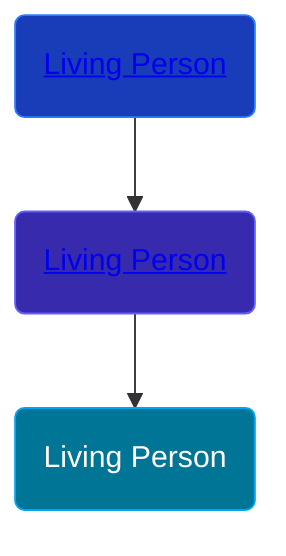

## 🟣 Living Person

Daughter of [Living Person](/people/2/20123685)



```mermaid
graph
classDef grands fill:#193cb8,stroke:#2b7fff,stroke-width:1px,color:#fff;
classDef parents fill:#372aac,stroke:#615fff,stroke-width:1px,color:#fff;
classDef primary fill:#007595,stroke:#00a6f4,stroke-width:1px,color:#fff;
64683164(Living Person):::primary
20123685(<a class="text-white" href="/people/2/20123685">Living Person</a>):::parents-->64683164
87147493(<a class="text-white" href="/people/8/87147493">Living Person</a>):::grands-->20123685
```

