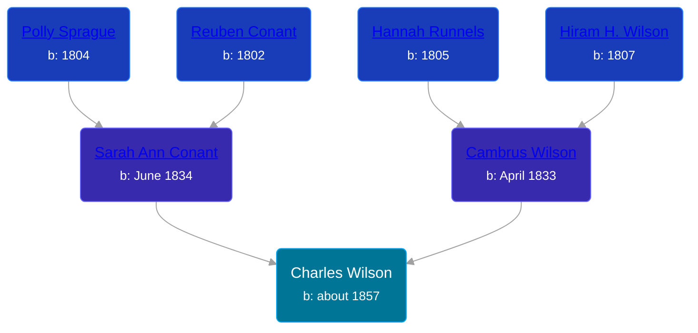

## 🔵 Charles Wilson
<small>Age: 14y</small>

Son of [Cambrus Wilson](/people/8/82575654) and [Sarah Ann Conant](/people/3/3929404)





### 📆 Events


Type | Date | Age at Event | Place
------ | ------ | ------ | ------
Birth | about 1857 |  | New York, USA
[Residence](#event-event-0) | 07 JUL 1860 | 3y, 7m, 7d | Savannah, Wayne, New York, USA
[Residence](#event-event-1) | 15 JUN 1870 | 13y, 6m, 15d | Savannah, Wayne, New York, USA
Death | 1871 | 14y |
[Burial](#event-event-6) |  |  | Butler-Savannah Cemetery, Savannah, Wayne, New York, USA



- **Birth**
**Date**: about 1857, Age:
**Place**: New York, USA
- **[Residence](#event-event-0)**
**Date**: 07 JUL 1860, Age: 3y, 7m, 7d
**Place**: Savannah, Wayne, New York, USA
- **[Residence](#event-event-1)**
**Date**: 15 JUN 1870, Age: 13y, 6m, 15d
**Place**: Savannah, Wayne, New York, USA
- **Death**
**Date**: 1871, Age: 14y
**Place**:
- **[Burial](#event-event-6)**
**Date**:
**Place**: Butler-Savannah Cemetery, Savannah, Wayne, New York, USA


### 📰 Event Sources

####  Residence, 07 JUL 1860
* 1860 US Census

####  Residence, 15 JUN 1870
* 1870 US Census

####  Burial
* Wayne County, NyGenWeb
