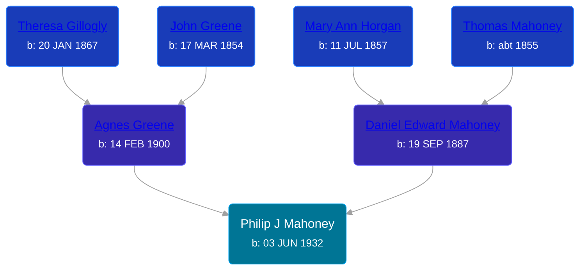

## 🔵 Philip J Mahoney
<small>Age: 75y, 2m, 8d</small>

Son of [Daniel Edward Mahoney](/people/2/24117676) and [Agnes Greene](/people/1/15565254)





### 📆 Events


Type | Date | Age at Event | Place
------ | ------ | ------ | ------
Birth | 03 JUN 1932 |  | Michigan, USA
[Residence](#event-event-0) | 11 APR 1950 | 17y, 10m, 8d | Owosso, Shiawassee, Michigan, USA
[Death](#event-event-4) | 11 AUG 2007 | 75y, 2m, 8d | Ohio, USA



- **Birth**
**Date**: 03 JUN 1932, Age:
**Place**: Michigan, USA
- **[Residence](#event-event-0)**
**Date**: 11 APR 1950, Age: 17y, 10m, 8d
**Place**: Owosso, Shiawassee, Michigan, USA
- **[Death](#event-event-4)**
**Date**: 11 AUG 2007, Age: 75y, 2m, 8d
**Place**: Ohio, USA


### 📰 Event Sources

####  Residence, 11 APR 1950
* 1950 US Census
>   
  > Name: Philip J Mahoney  
  > Age: 17  
  > Birth Date: abt 1933  
  > Gender: Male  
  > Race: White  
  > Birth Place: Michigan  
  > Marital Status: Never Married (Single)  
  > Relation to Head of House: Son  
  > Residence Date: 1950  
  > Home in 1950: Owosso, Shiawassee, Michigan, USA  
  > Street Name: Howell  
  > House Number: 206  
  > Apartment Number: Lo  
  > Dwelling Number: 192  
  > Farm: No  
  > Inferred Previous Residence Place:   
  > Occupation: Pin Setter  
  > Industry: Bowling alley  
  > Father Birth Place: USA  
  > Mother Birth Place: USA  
  > Occupation Category: Working  
  > Hours Worked: 18  
  > Worker Class: Private  
  > Same House: Yes  
  > School Completed: S12  
  > School Attendance: No  
  > Weeks Worked: 48  
  > Income: 540  
  > Other Income: none  
  > Supplemental Income: none  
  >   
  > Household members:  
  > D. Edward Mahoney, 62, Head  
  > Agnes Mahoney, 50, Wife  
  > Gerald F Mahoney, 19, Son  
  > Philip J Mahoney, 17, Son  
  > Thomas A Mahoney, 16, Son  
  >

####  Death, 11 AUG 2007
* Ohio, U.S., Death Records, 1908-1932, 1938-2022
>   
  > Name: Philip J Mahoney  
  > Gender: Male  
  > Race: White  
  > Marital Status: Married  
  > Death Age: 75  
  > Birth Date: 3 Jun 1932  
  > Birth Place: Michigan, USA  
  > Residence Place: Champaign, Ohio, USA  
  > Residence Zip Code: 45431-2823  
  > Death Date: 11 Aug 2007  
  > Death Place: Ohio, USA  
  > Death Hospital: Inpatient  
  > Industry: Usaf  
  > Occupation: Staff sergeant  
  > Education: Associate Degree  
  > Father: Mahoney  
  > Certificate Number: 067681  
  > Inquest Questions: Certifier: Physician; Method of Disposition: Burial; Time of Death: 11:40 Pm  
  >
