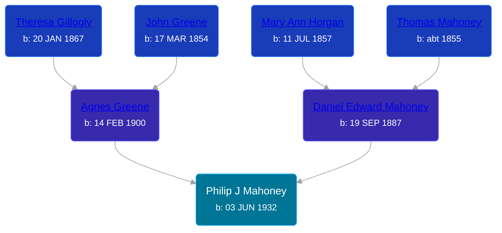

## 🔵 Philip J Mahoney
<small>Age: 75y, 2m, 8d</small>

Son of [Daniel Edward Mahoney](/people/2/24117676) and [Agnes Greene](/people/1/15565254)



```mermaid
graph
classDef grands fill:#193cb8,stroke:#2b7fff,stroke-width:1px,color:#fff;
classDef parents fill:#372aac,stroke:#615fff,stroke-width:1px,color:#fff;
classDef primary fill:#007595,stroke:#00a6f4,stroke-width:1px,color:#fff;
64895326(Philip J Mahoney<br /><small>b: 03 JUN 1932</small>):::primary
15565254(<a class="text-white" href="/people/1/15565254">Agnes Greene</a><br /><small>b: 14 FEB 1900</small>):::parents-->64895326
67581747(<a class="text-white" href="/people/6/67581747">Theresa Gillogly</a><br /><small>b: 20 JAN 1867</small>):::grands-->15565254
71088434(<a class="text-white" href="/people/7/71088434">John Greene</a><br /><small>b: 17 MAR 1854</small>):::grands-->15565254
24117676(<a class="text-white" href="/people/2/24117676">Daniel Edward Mahoney</a><br /><small>b: 19 SEP 1887</small>):::parents-->64895326
90749846(<a class="text-white" href="/people/9/90749846">Mary Ann Horgan</a><br /><small>b: 11 JUL 1857</small>):::grands-->24117676
41476460(<a class="text-white" href="/people/4/41476460">Thomas Mahoney</a><br /><small>b: abt 1855</small>):::grands-->24117676
linkStyle default stroke:#a1a1a1
```


### 📆 Events


Type | Date | Age at Event | Place
------ | ------ | ------ | ------
Birth | 03 JUN 1932 |  | Michigan, USA
[Residence](#event-event-0) | 11 APR 1950 | 17y, 10m, 8d | Owosso, Shiawassee, Michigan, USA
[Death](#event-event-4) | 11 AUG 2007 | 75y, 2m, 8d | Ohio, USA



- **Birth**
**Date**: 03 JUN 1932, Age:
**Place**: Michigan, USA
- **[Residence](#event-event-0)**
**Date**: 11 APR 1950, Age: 17y, 10m, 8d
**Place**: Owosso, Shiawassee, Michigan, USA
- **[Death](#event-event-4)**
**Date**: 11 AUG 2007, Age: 75y, 2m, 8d
**Place**: Ohio, USA


### 📰 Event Sources

####  Residence, 11 APR 1950
* 1950 US Census
>   
  > Name: Philip J Mahoney  
  > Age: 17  
  > Birth Date: abt 1933  
  > Gender: Male  
  > Race: White  
  > Birth Place: Michigan  
  > Marital Status: Never Married (Single)  
  > Relation to Head of House: Son  
  > Residence Date: 1950  
  > Home in 1950: Owosso, Shiawassee, Michigan, USA  
  > Street Name: Howell  
  > House Number: 206  
  > Apartment Number: Lo  
  > Dwelling Number: 192  
  > Farm: No  
  > Inferred Previous Residence Place:   
  > Occupation: Pin Setter  
  > Industry: Bowling alley  
  > Father Birth Place: USA  
  > Mother Birth Place: USA  
  > Occupation Category: Working  
  > Hours Worked: 18  
  > Worker Class: Private  
  > Same House: Yes  
  > School Completed: S12  
  > School Attendance: No  
  > Weeks Worked: 48  
  > Income: 540  
  > Other Income: none  
  > Supplemental Income: none  
  >   
  > Household members:  
  > D. Edward Mahoney, 62, Head  
  > Agnes Mahoney, 50, Wife  
  > Gerald F Mahoney, 19, Son  
  > Philip J Mahoney, 17, Son  
  > Thomas A Mahoney, 16, Son  
  >

####  Death, 11 AUG 2007
* Ohio, U.S., Death Records, 1908-1932, 1938-2022
>   
  > Name: Philip J Mahoney  
  > Gender: Male  
  > Race: White  
  > Marital Status: Married  
  > Death Age: 75  
  > Birth Date: 3 Jun 1932  
  > Birth Place: Michigan, USA  
  > Residence Place: Champaign, Ohio, USA  
  > Residence Zip Code: 45431-2823  
  > Death Date: 11 Aug 2007  
  > Death Place: Ohio, USA  
  > Death Hospital: Inpatient  
  > Industry: Usaf  
  > Occupation: Staff sergeant  
  > Education: Associate Degree  
  > Father: Mahoney  
  > Certificate Number: 067681  
  > Inquest Questions: Certifier: Physician; Method of Disposition: Burial; Time of Death: 11:40 Pm  
  >
* Dayton Daily News  - 14 Aug 2007 page 13
>   
  > MAHONEY, Philip J., age 75, of Riverside, OH passed away on Saturday, August 11, 2007. Philip was born June 3, 1932 in Owosso, MI, the son of Edward and Agnes (Greene) Mahoney, who preceded him in death. He is survived by his loving wife of 46 years, Marian S. (Genova) Mahoney, of Riverside; two sons and daughters-in-law, Gregory and Anna Siverling, of Shrewsbury, MA, Paul and Ellen Siverling, of Beavercreek; two daughters and a son-in-law, Marianne Lombardo, of Columbus, Susan and Mark Pleiman, of Hershey, PA; 5 grandchildren, Jesse, Valierie, Mya, Sophia, and Zach; two brothers and sisters-in-law, Gerald and Eleanor Mahoney, of MI, Tom and Carol Mahoney, of MI. Philip retired from Wright-Patterson Air Force Base after a distinguished 20 year career with the United States Air Force. He was a member of the St. Joseph Catholic Church, the Milton Athletic Club and was a Life Member of V.F.W Post 2800. A true gentleman and a brave man, very loved by his family and everyone who knew him. How blest we are to have had him in our lives, your wit, your strength, your music. Although sadly missed, you will forever live in our hearts. Prayers will be held at 9:15 A.M. on Thursday, August 16, 2007, at the TOBIAS FUNERAL HOME-BEAVERCREEK CHAPEL, 3970 Dayton-Xenia Road at Grange Hall Road. Mass of Christian Burial will follow at 10 A.M. at St. Joseph Catholic Church, 411 E. Second Street with Father Louis Osterhage, celebrant. Intermet with full military honors will be held at Dayton National Cemetery. The family will receive friends at the funeral home from 5-8 P.M.  on Wednesday, August 15, 2007. Condolences may be sent to the family at www.tobiasfuneralhome.com.
