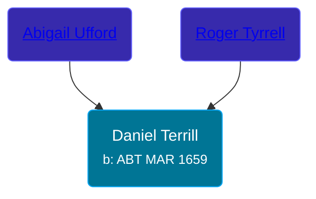

## 🔵 Daniel Terrill
<small>Age: 68y, 3m, 10d</small>

Son of [Roger Tyrrell](/people/2/2108514) and [Abigail Ufford](/people/9/99473444)





### 📆 Events


Type | Date | Age at Event | Place
------ | ------ | ------ | ------
[Birth](#event-event-2) | ABT MAR 1659 |  |
[Death](#event-event-3) | 10 JUN 1727 | 68y, 3m, 10d | Milford, Connecticut, USA
[Burial](#event-event-4) |  |  | Milford Cemetery



- **[Birth](#event-event-2)**
**Date**: ABT MAR 1659, Age:
**Place**:
- **[Death](#event-event-3)**
**Date**: 10 JUN 1727, Age: 68y, 3m, 10d
**Place**: Milford, Connecticut, USA
- **[Burial](#event-event-4)**
**Date**:
**Place**: Milford Cemetery


### 📰 Event Sources

####  Birth, ABT MAR 1659
* Roger and Abigail (Ufford) Terrill and Some Descendants: 1632 - 1993  - 6

####  Death, 10 JUN 1727
* Roger and Abigail (Ufford) Terrill and Some Descendants: 1632 - 1993  - 15

####  Burial
* Roger and Abigail (Ufford) Terrill and Some Descendants: 1632 - 1993  - 15