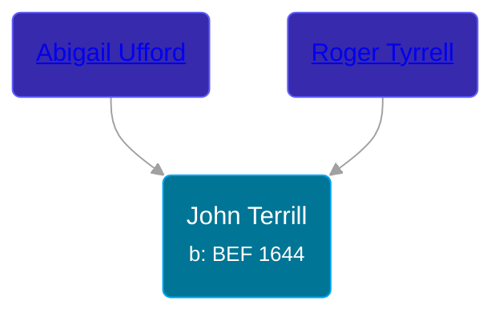

## 🔵 John Terrill
<small>Age: 76y, 3m, 31d</small>

Son of [Roger Tyrrell](/people/2/2108514) and [Abigail Ufford](/people/9/99473444)





### 📆 Events


Type | Date | Age at Event | Place
------ | ------ | ------ | ------
[Birth](#event-event-2) | BEF 1644 |  |
[Baptism](#event-event-0) | Aug 1644 | 8m |
[Occupation](#event-event-1) |  |  |
[Death](#event-event-5) | BET 31 MAR 1720 AND 12 FEB 1723 | 76y, 3m, 31d | Milford, Connecticut, USA



- **[Birth](#event-event-2)**
**Date**: BEF 1644, Age:
**Place**:
- **[Baptism](#event-event-0)**
**Date**: Aug 1644, Age: 8m
**Place**:
- **[Occupation](#event-event-1)**
**Date**:
**Place**:
- **[Death](#event-event-5)**
**Date**: BET 31 MAR 1720 AND 12 FEB 1723, Age: 76y, 3m, 31d
**Place**: Milford, Connecticut, USA


## 👩‍❤️‍👨 Relationships

### 🟣 [Abigail ](/people/4/48582652)

#### Events


Type | Date | Age at Event | Place
------ | ------ | ------ | ------
[Marriage](#event-family-0-event-0) | abt 1673 | 29y |



- **[Marriage](#event-family-0-event-0)**
**Date**: abt 1673, Age: 29y
**Place**:


#### Children With Abigail
* 🔵 [John Terrill](/people/7/7349384), b. ABT 10 MAR 1675
* 🔵 [Samuel Terrill](/people/7/74196422), b. 02 APR 1678
* 🟣 [Abigail Terrill](/people/9/95305216), b. 13 JUN 1681
* 🟣 [Berthia Terrill](/people/7/78343120), b. ABT 1683
* 🟣 [Sarah Terrill](/people/2/2405910), b. Nov 1685
* 🔵 [John Terrill](/people/1/13695735), b. ABT 1687
* 🟣 [Hannah Terrill](/people/7/73926783), b. abt 1689
* 🔵 [Nathan Terrill](/people/9/9608654), b. ABT 1693
* 🔵 [Josiah Terrill](/people/8/80183041), b. 18 AUG 1695
* 🔵 [Gamaliel Terrill](/people/8/82123968), b. ABT 1696
### 📰 Event Sources

####  Birth, BEF 1644
* Roger and Abigail (Ufford) Terrill and Some Descendants: 1632 - 1993  - 6

####  Baptism, Aug 1644
* Roger and Abigail (Ufford) Terrill and Some Descendants: 1632 - 1993  - 6,9

####  Occupation
* Roger and Abigail (Ufford) Terrill and Some Descendants: 1632 - 1993  - 9

####  Marriage, abt 1673
* Roger and Abigail (Ufford) Terrill and Some Descendants: 1632 - 1993  - 9
####  Death, BET 31 MAR 1720 AND 12 FEB 1723
* Roger and Abigail (Ufford) Terrill and Some Descendants: 1632 - 1993  - 9
