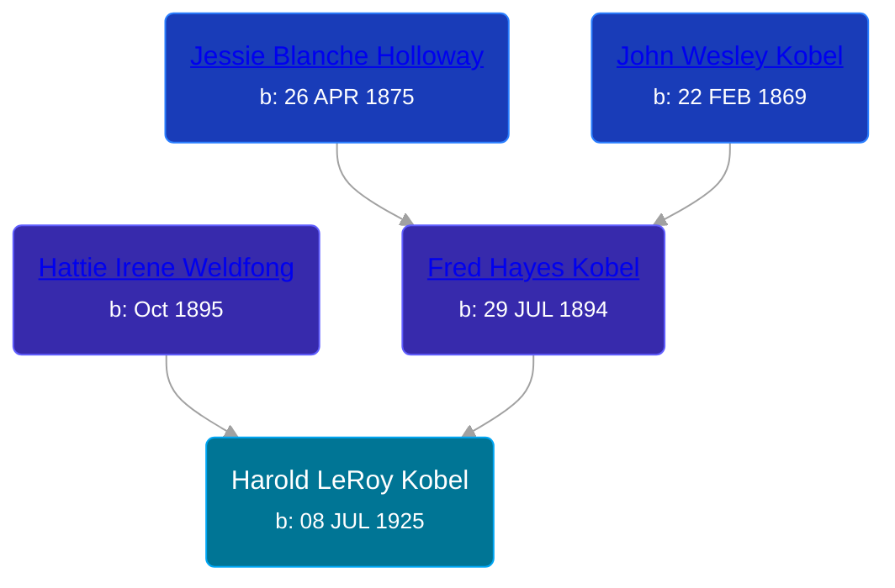

## 🔵 Harold LeRoy Kobel
<small>Age: 19y, 1m, 10d</small>

Son of [Fred Hayes Kobel](/people/1/1672312) and [Hattie Irene Weldfong](/people/5/59131944)





### 📆 Events


Type | Date | Age at Event | Place
------ | ------ | ------ | ------
[Birth](#event-event-2) | 08 JUL 1925 |  | Warner Township, Antrim, Michigan, USA
[Death](#event-event-3) | 18 AUG 1944 | 19y, 1m, 10d | France
[Burial](#event-event-4) |  |  | Maple Hill Cemetery, Elmira Township, Antrim, Michigan, USA



- **[Birth](#event-event-2)**
**Date**: 08 JUL 1925, Age:
**Place**: Warner Township, Antrim, Michigan, USA
- **[Death](#event-event-3)**
**Date**: 18 AUG 1944, Age: 19y, 1m, 10d
**Place**: France
- **[Burial](#event-event-4)**
**Date**:
**Place**: Maple Hill Cemetery, Elmira Township, Antrim, Michigan, USA


### 📰 Event Sources

####  Birth, 08 JUL 1925
* Ron Wilson's Research

####  Death, 18 AUG 1944
* Ron Wilson's Research

####  Burial
* findagrave.com