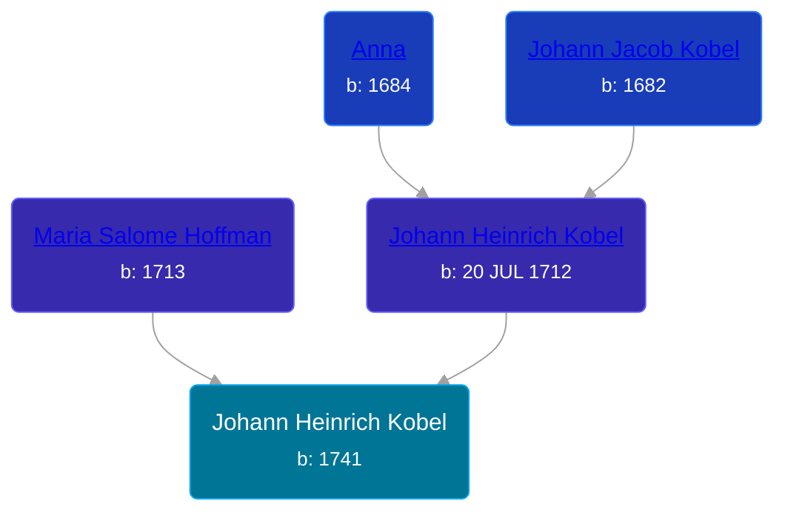

## 🔵 Johann Heinrich Kobel
<small>Age: 49y</small>

Son of [Johann Heinrich Kobel](/people/7/70639420) and [Maria Salome Hoffman](/people/5/59188360)





### 📆 Events


Type | Date | Age at Event | Place
------ | ------ | ------ | ------
Birth | 1741 |  | Bethel Township, Berks, Pennsylvania, USA
Death | aft 1790 | 49y | Northumberland, Pennsylvania, USA



- **Birth**
**Date**: 1741, Age:
**Place**: Bethel Township, Berks, Pennsylvania, USA
- **Death**
**Date**: aft 1790, Age: 49y
**Place**: Northumberland, Pennsylvania, USA


## 👩‍❤️‍👨 Relationships

### 🟣 [Catherine ](/people/6/61051648), b. abt 1743

#### Children With Catherine
* 🔵 [Christian Kobel](/people/6/64236632), b. abt 1765