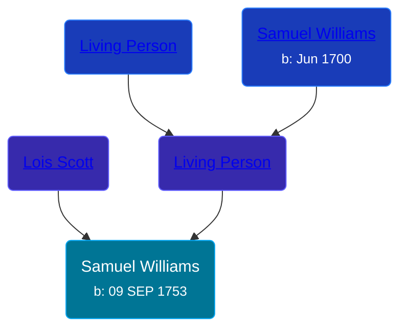

## 🔵 Samuel Williams
<small>Age: 3m, 22d</small>

Son of [Living Person](/people/5/55971024) and [Lois Scott](/people/3/31542750)





### 📆 Events


Type | Date | Age at Event | Place
------ | ------ | ------ | ------
[Birth](#event-event-2) | 09 SEP 1753 |  |
[Death](#event-event-3) | 31 DEC 1753 | 3m, 22d |



- **[Birth](#event-event-2)**
**Date**: 09 SEP 1753, Age:
**Place**:
- **[Death](#event-event-3)**
**Date**: 31 DEC 1753, Age: 3m, 22d
**Place**:


### 📰 Event Sources

####  Birth, 09 SEP 1753
* The Town and City of Waterbury, Connecticut  - 154

####  Death, 31 DEC 1753
* The Town and City of Waterbury, Connecticut  - 154