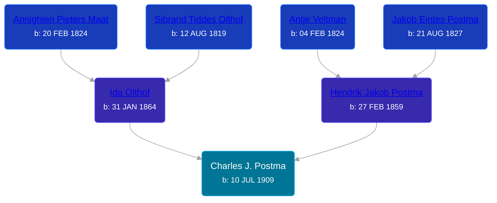

## 🔵 Charles J. Postma
<small>Age: 86y, 2m, 17d</small>

Son of [Hendrik Jakob Postma](/people/3/31727152) and [Ida Olthof](/people/6/60020862)





### 📆 Events


Type | Date | Age at Event | Place
------ | ------ | ------ | ------
[Birth](#event-event-2) | 10 JUL 1909 |  | Gaines Township, Kent, Michigan, USA
[Residence](#event-event-0) | 1910 | 4m, 20d | Gaines Township, Kent, Michigan, USA
[Residence](#event-event-1) | 14 JAN 1920 | 10y, 6m, 4d | Gaines Township, Kent, Michigan, USA
[Residence](#event-event-2) | 24 APR 1930 | 20y, 9m, 14d | Gaines Township, Kent, Michigan, USA
[Residence](#event-event-3) | 05 APR 1940 | 30y, 8m, 25d | Gaines Township, Kent, Michigan, USA
[Death](#event-event-7) | 27 SEP 1995 | 86y, 2m, 17d | Wayland, Allegan, Michigan, USA
Burial | 30 SEP 1995 | 86y, 2m, 20d | Dorr Cemetery, Dorr Township, Allegan, Michigan, USA



- **[Birth](#event-event-2)**
**Date**: 10 JUL 1909, Age:
**Place**: Gaines Township, Kent, Michigan, USA
- **[Residence](#event-event-0)**
**Date**: 1910, Age: 4m, 20d
**Place**: Gaines Township, Kent, Michigan, USA
- **[Residence](#event-event-1)**
**Date**: 14 JAN 1920, Age: 10y, 6m, 4d
**Place**: Gaines Township, Kent, Michigan, USA
- **[Residence](#event-event-2)**
**Date**: 24 APR 1930, Age: 20y, 9m, 14d
**Place**: Gaines Township, Kent, Michigan, USA
- **[Residence](#event-event-3)**
**Date**: 05 APR 1940, Age: 30y, 8m, 25d
**Place**: Gaines Township, Kent, Michigan, USA
- **[Death](#event-event-7)**
**Date**: 27 SEP 1995, Age: 86y, 2m, 17d
**Place**: Wayland, Allegan, Michigan, USA
- **Burial**
**Date**: 30 SEP 1995, Age: 86y, 2m, 20d
**Place**: Dorr Cemetery, Dorr Township, Allegan, Michigan, USA


### 📰 Event Sources

####  Birth, 10 JUL 1909
* Michigan, U.S., Birth Records, 1867-1914
>   
  > Name: Charles Postma  
  > Gender: Male  
  > Birth Date: 10 Jul 1909  
  > Birth Place: Gaines, Michigan, USA  
  > Father: Henry Postma  
  > Mother: Ida Postma  
  > Jurisdiction Number: 214-500  
  > Reference Number: Vol 26B  
  >

####  Residence, 1910
* 1910 US Census

####  Residence, 14 JAN 1920
* 1920 US Census

####  Residence, 24 APR 1930
* 1930 US Census

####  Residence, 05 APR 1940
* 1940 US Census

####  Death, 27 SEP 1995
* U.S., Social Security Death Index, 1935-2014
>   
  > Name: CHARLES POSTMA  
  > Birth: 10 Jul 1909  
  > Death: 27 Sep 1995  
  > Last Residence: 49348 (Wayland, Allegan, MI)  
  > Last Benefit: (none specified)  
  > SSN: ###-##-####  
  > Issued: Michigan
* The Grand Rapids Press  - 29 Sep 1995
>   
  > POSTMA -- Charles J. Postma, aged 86, of Wayland, passed away Wednesday, September 27, 1995. He is survived by his son, Charles (Elaina) Postma of South Carolina; and a daughter Eloise (Ted) Lettinga of Dorr; eight grandchildren; and five great grandchildren. Gravside Funeral Service 1 p.m. Saturday at Dorr Cemetery with Pastor Ronald Tuinstra officiating.
* Michigan Deaths, 1971-1996
>   
  > Name:  Charles J. Postma  
  > Birth Date: 10 Jul 1909  
  > Death Date: 27 Sep 1995  
  > Gender: Male  
  > Residence: Wayland, Allegan, Michigan  
  > Place of Death: Wayland, Allegan, Michigan
