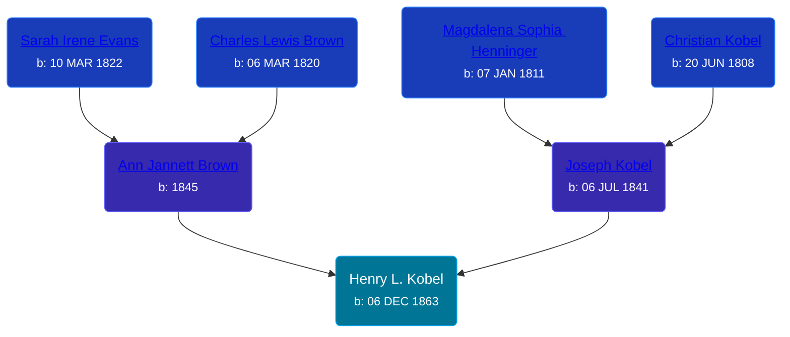

## 🔵 Henry L. Kobel
<small>Age: 45y, 1m, 14d</small>

Son of [Joseph Kobel](/people/4/44694656) and [Ann Jannett Brown](/people/2/25015094)





### 📆 Events


Type | Date | Age at Event | Place
------ | ------ | ------ | ------
[Birth](#event-event-2) | 06 DEC 1863 |  | Isabella, Michigan, USA
[Residence](#event-event-0) | 30 JUN 1870 | 6y, 6m, 24d | Union Township, Antrim, Michigan, USA
[Residence](#event-event-1) | 16 JUN 1880 | 16y, 6m, 10d | Union Township, Antrim, Michigan, USA
[Residence](#event-event-2) | 01 JUN 1900 | 36y, 5m, 25d | Warner Township, Antrim, Michigan, USA
[Death](#event-event-6) | 20 JAN 1909 | 45y, 1m, 14d | Warner Township, Antrim, Michigan, USA
[Burial](#event-event-7) |  |  | Maple Hill Cemetery, Warner Township, Antrim, Michigan, USA



- **[Birth](#event-event-2)**
**Date**: 06 DEC 1863, Age:
**Place**: Isabella, Michigan, USA
- **[Residence](#event-event-0)**
**Date**: 30 JUN 1870, Age: 6y, 6m, 24d
**Place**: Union Township, Antrim, Michigan, USA
- **[Residence](#event-event-1)**
**Date**: 16 JUN 1880, Age: 16y, 6m, 10d
**Place**: Union Township, Antrim, Michigan, USA
- **[Residence](#event-event-2)**
**Date**: 01 JUN 1900, Age: 36y, 5m, 25d
**Place**: Warner Township, Antrim, Michigan, USA
- **[Death](#event-event-6)**
**Date**: 20 JAN 1909, Age: 45y, 1m, 14d
**Place**: Warner Township, Antrim, Michigan, USA
- **[Burial](#event-event-7)**
**Date**:
**Place**: Maple Hill Cemetery, Warner Township, Antrim, Michigan, USA


### 📰 Event Sources

####  Birth, 06 DEC 1863
* Ron Wilson's Research

####  Residence, 30 JUN 1870
* 1870 US Census

####  Residence, 16 JUN 1880
* 1880 US Census

####  Residence, 01 JUN 1900
* 1900 US Census

####  Death, 20 JAN 1909
* Michigan, Death Records, 1867-1950
>   
  > Name:Henry L Kobel  
  > Gender:Male  
  > Race:White  
  > Marital Status:Single  
  > Death Age:45  
  > Birth Date:6 Dec 1864  
  > Birth Place:Michigan  
  > Death Date:20 Jan 1909  
  > Death Place:Warren, Antrim, Michigan, USA  
  > File Number:473  
  > Father:Joseph Kobel  
  > Mother:A G Broron

####  Burial
* findagrave.com