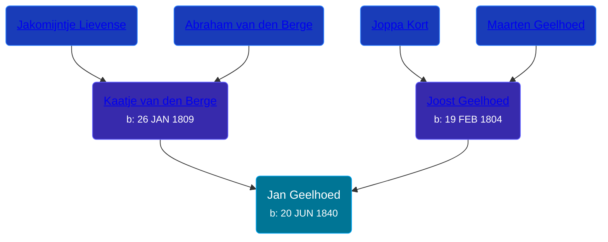

## 🔵 Jan Geelhoed
<small>Age: 90y, 5m, 2d</small>

Son of [Joost Geelhoed](/people/7/72031888) and [Kaatje van den Berge](/people/3/32271874)





### 📆 Events


Type | Date | Age at Event | Place
------ | ------ | ------ | ------
[Birth](#event-event-2) | 20 JUN 1840 |  | Dreischor, Zeeland, Netherlands
[Death](#event-event-3) | 22 NOV 1930 | 90y, 5m, 2d | Nieuwerkerk, Zeeland, Netherlands



- **[Birth](#event-event-2)**
**Date**: 20 JUN 1840, Age:
**Place**: Dreischor, Zeeland, Netherlands
- **[Death](#event-event-3)**
**Date**: 22 NOV 1930, Age: 90y, 5m, 2d
**Place**: Nieuwerkerk, Zeeland, Netherlands


### 📰 Event Sources

####  Birth, 20 JUN 1840
* Geelhoet, Geelhoed & Geelhoedt Genealogie

####  Death, 22 NOV 1930
* Geelhoet, Geelhoed & Geelhoedt Genealogie