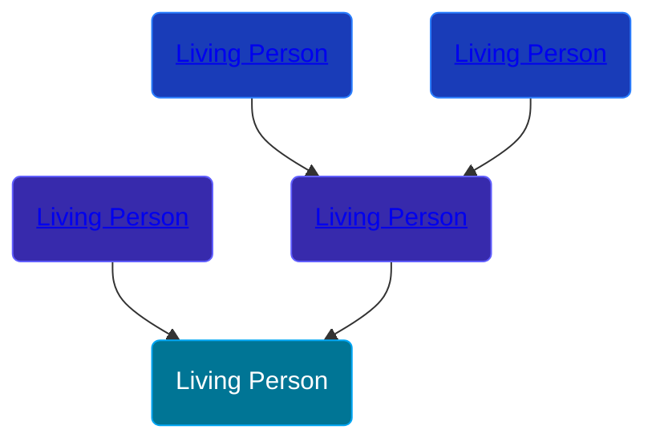

## 🟣 Living Person

Daughter of [Living Person](/people/2/24504153) and [Living Person](/people/3/33630976)



```mermaid
graph
classDef grands fill:#193cb8,stroke:#2b7fff,stroke-width:1px,color:#fff;
classDef parents fill:#372aac,stroke:#615fff,stroke-width:1px,color:#fff;
classDef primary fill:#007595,stroke:#00a6f4,stroke-width:1px,color:#fff;
66378416(Living Person):::primary
33630976(<a class="text-white" href="/people/3/33630976">Living Person</a>):::parents-->66378416
24504153(<a class="text-white" href="/people/2/24504153">Living Person</a>):::parents-->66378416
46067436(<a class="text-white" href="/people/4/46067436">Living Person</a>):::grands-->24504153
63426026(<a class="text-white" href="/people/6/63426026">Living Person</a>):::grands-->24504153
```

