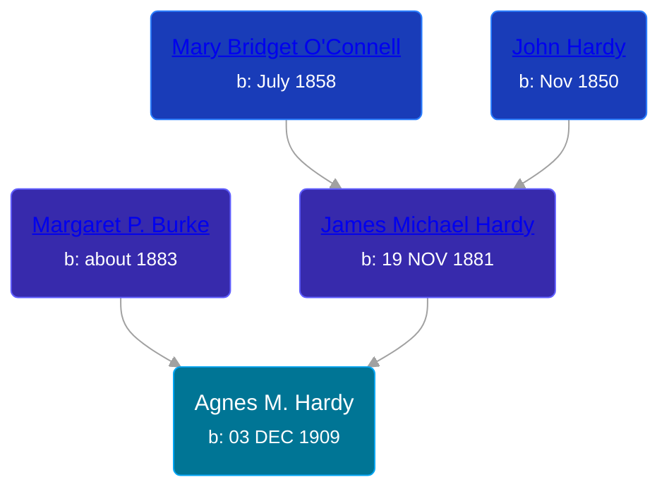

## 🟣 Agnes M. Hardy
<small>Age: 93y, 5m, 7d</small>

Daughter of [James Michael Hardy](/people/1/11204316) and [Margaret P. Burke](/people/2/29782872)





### 📆 Events


Type | Date | Age at Event | Place
------ | ------ | ------ | ------
Birth | 03 DEC 1909 |  | New York, USA
[Residence](#event-event-0) | 27 APR 1910 | 4m, 24d | Brooklyn, Kings, New York, USA
[Residence](#event-event-1) | 08 JAN 1920 | 10y, 1m, 5d | Omaha, Douglas, Nebraska, USA
[Death](#event-event-5) | 10 MAY 2003 | 93y, 5m, 7d | Valparaiso, Indiana, USA



- **Birth**
**Date**: 03 DEC 1909, Age:
**Place**: New York, USA
- **[Residence](#event-event-0)**
**Date**: 27 APR 1910, Age: 4m, 24d
**Place**: Brooklyn, Kings, New York, USA
- **[Residence](#event-event-1)**
**Date**: 08 JAN 1920, Age: 10y, 1m, 5d
**Place**: Omaha, Douglas, Nebraska, USA
- **[Death](#event-event-5)**
**Date**: 10 MAY 2003, Age: 93y, 5m, 7d
**Place**: Valparaiso, Indiana, USA


## 👩‍❤️‍👨 Relationships

### 🔵 [Leo E. Simon](/people/8/89858351)

#### Events


Type | Date | Age at Event | Place
------ | ------ | ------ | ------
Marriage | Mar 1927 | 17y, 2m, 27d | Sioux City, Woodbury, Iowa, USA



- **Marriage**
**Date**: Mar 1927, Age: 17y, 2m, 27d
**Place**: Sioux City, Woodbury, Iowa, USA


#### Children With Leo E. Simon
* 🔵 [James E. Simon](/people/3/33687347)
* 🔵 [Living Person](/people/3/3006336)
* 🔵 [Richard N. Simon](/people/8/83677879)
* 🔵 [Living Person](/people/5/52976256)
### 📰 Event Sources

####  Residence, 27 APR 1910
* 1910 US Census

####  Residence, 08 JAN 1920
* 1920 US Census

####  Marriage, Mar 1927

####  Death, 10 MAY 2003
* The Times - 12 May 2003, pg 36
>
  > Agnes M. Simon
  >
  > • Valparaiso
  >
  > Agnes M. Simon of Valparaiso, passed away Saturday, May 10, 2003 in Valparaiso. She was born December 3, 1909 in New York, New York to James and Margaret (Burke) Hardy.
  >
  > In March of 1927 in Sioux City, Iowa, she married Leo E. Simon who passed away in June of 1964. She is survived by her son, Leo M. Simon of Valparaiso, several grandchildren and great-grandchildren. Also preceding her in death are her parents, three sons, James E. Richard N. and Donald F. Simon, her daughter, Betty Lou Simon and three sisters and three brothers.
  >
  > Agnes was a member of St. Teresa of Avila Catholic Church in Valparaiso, a charter member of Young Ladies Rosarian Institute in Larkspur, California, and V.F.W. Post 988 Ladies Auxiliary. She was assistant dietician at Ross General Hospital in Ross, California, retiring from there in 1979. Agnes was also a caterer and caregiver for the elderly.
  >
  > Funeral services are to be held in California and burial will take place in Mt. Olivet Cemetery in San Rafael, California. In lieu of flowers, memorial contributions can be made to Horton Hospice Center, 2404 Valparaiso St., Valparaiso, IN 46383, or donor's choice. Bartholomew Funeral Home in Valparaiso, in charge of arrangements.
