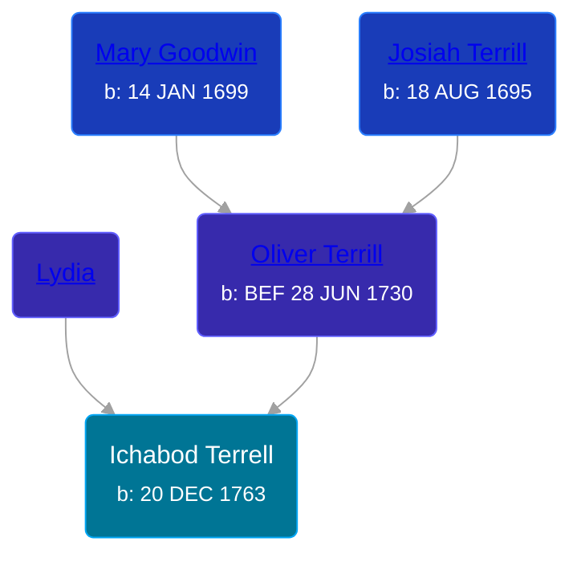

## 🔵 Ichabod Terrell
<small>Age: 61y, 7m, 3d</small>

Son of [Oliver Terrill](/people/9/94505283) and [Lydia ](/people/1/18213296)





### 📆 Events


Type | Date | Age at Event | Place
------ | ------ | ------ | ------
[Birth](#event-event-2) | 20 DEC 1763 |  | Waterbury, New Haven, Connecticut, USA
Death | 23 JUL 1825 | 61y, 7m, 3d | Ridgeville, Lorain, Ohio, USA
[Burial](#event-event-4) |  |  | Ridgeville Center Cemetery



- **[Birth](#event-event-2)**
**Date**: 20 DEC 1763, Age:
**Place**: Waterbury, New Haven, Connecticut, USA
- **Death**
**Date**: 23 JUL 1825, Age: 61y, 7m, 3d
**Place**: Ridgeville, Lorain, Ohio, USA
- **[Burial](#event-event-4)**
**Date**:
**Place**: Ridgeville Center Cemetery


## 👩‍❤️‍👨 Relationships

### 🟣 [Rhoda Williams](/people/2/220352), b. 17 APR 1767

#### Events


Type | Date | Age at Event | Place
------ | ------ | ------ | ------
[Marriage](#event-family-0-event-0) | 01 MAR 1784 | 20y, 2m, 11d | Connecticut, USA



- **[Marriage](#event-family-0-event-0)**
**Date**: 01 MAR 1784, Age: 20y, 2m, 11d
**Place**: Connecticut, USA


#### Children With Rhoda Williams
* 🔵 [Tillotson S. Terrell](/people/2/25548435), b. 01 MAY 1785
* 🟣 [Lydia Terrell](/people/8/84586144), b. 02 SEP 1787
* 🔵 [Philander Terrell](/people/2/24198270), b. 1789
* 🔵 [Oliver Terrell](/people/6/67228756), b. 02 SEP 1791
* 🟣 [Lucinda Terrell](/people/4/4141148), b. 06 NOV 1795
* 🟣 [Orpha Terrell](/people/6/62971808), b. 02 MAY 1798
* 🔵 [Ichabod Terrell](/people/8/85336048), b. 01 OCT 1800
* 🔵 [Elihu Franklin Terrell](/people/8/86596293), b. 03 JAN 1802
* 🔵 [Horace Terrell](/people/4/43136442), b. 10 AUG 1803
* 🔵 [Henry Terrell](/people/6/6534130), b. 07 APR 1806
### 📰 Event Sources

####  Birth, 20 DEC 1763
* The Town and City of Waterbury, Connecticut  - 136
* Roger and Abigail (Ufford) Terrill and Some Descendants: 1632 - 1993  - 37
* Connecticut Town Birth Records, pre-1870 (Barbour Collection)  - 354
>   
  > Ichabod, s. [Oliver & Lidda], b. Dec. 20, 1764  
  > Vol 1, Pg 475

####  Burial
* Ridgeville Cemetery
>   
  > Terrell, Ichabod, d July 23, 1825, 62y, RW

####  Marriage, 01 MAR 1784
* Roger and Abigail (Ufford) Terrill and Some Descendants: 1632 - 1993  - 72
* U.S. and International Marriage Records, 1560-1900
>   
  > Name: Rhoda Williams  
  > Gender: Female  
  > Birth Place: CT  
  > Birth Year: 1767  
  > Spouse Name: Ichabod Terrill  
  > Spouse Birth Place: CT  
  > Spouse Birth Year: 1763  
  > Marriage Year: 1784  
  > Marriage State: CT  
  > Number Pages: 1
* The Town and City of Waterbury, Connecticut  - 135
* The Chronicle Telegram  - 27 May 1961, pg 17