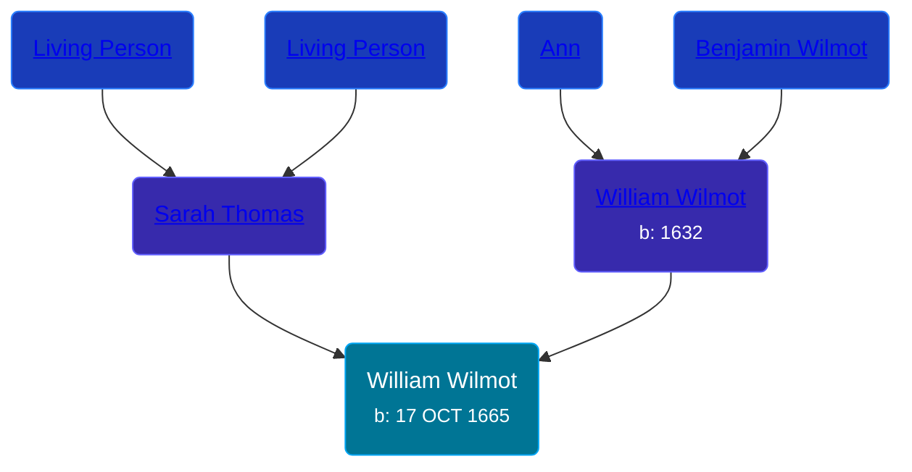

## 🔵 William Wilmot
<small>Age: 48y, 3m, 8d</small>

Son of [William Wilmot](/people/4/47205976) and [Sarah Thomas](/people/2/28506175)





### 📆 Events


Type | Date | Age at Event | Place
------ | ------ | ------ | ------
[Birth](#event-event-2) | 17 OCT 1665 |  |
[Death](#event-event-3) | 25 JAN 1714 | 48y, 3m, 8d |



- **[Birth](#event-event-2)**
**Date**: 17 OCT 1665, Age:
**Place**:
- **[Death](#event-event-3)**
**Date**: 25 JAN 1714, Age: 48y, 3m, 8d
**Place**:


### 📰 Event Sources

####  Birth, 17 OCT 1665
* The New England Historical and Genealogical Register  - 68

####  Death, 25 JAN 1714
* The New England Historical and Genealogical Register  - 69