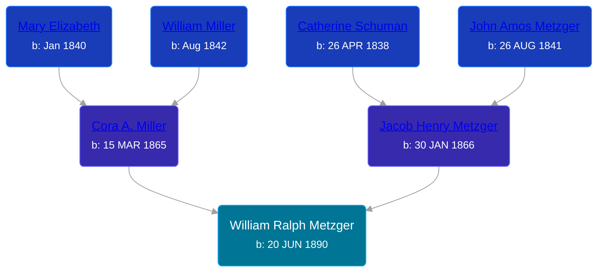

## 🔵 William Ralph Metzger
<small>Age: 51y, 8m, 20d</small>

Son of [Jacob Henry Metzger](/people/1/13773745) and [Cora A. Miller](/people/1/12053368)





### 📆 Events


Type | Date | Age at Event | Place
------ | ------ | ------ | ------
[Birth](#event-event-2) | 20 JUN 1890 |  | Richland, Whitley, Indiana, USA
[Residence](#event-event-0) | 21 JUN 1900 | 10y, 1d | Richland, Whitley, Indiana, USA
[Residence](#event-event-1) | 27 APR 1910 | 19y, 10m, 7d | Columbia, Whitley, Indiana, USA
[Residence](#event-event-2) | 12 JAN 1920 | 29y, 6m, 22d | Columbia, Whitley, Indiana, USA
[Residence](#event-event-3) | 14 MAY 1930 | 39y, 10m, 24d | Dorr Township, Allegan, Michigan, USA
[Residence](#event-event-4) | 1935 | 44y, 5m, 10d | Dorr Township, Allegan, Michigan, USA
[Residence](#event-event-5) | 15 APR 1940 | 49y, 9m, 25d | Dorr Township, Allegan, Michigan, USA
[Death](#event-event-9) | 10 MAR 1942 | 51y, 8m, 20d | Plainwell, Allegan, Michigan, USA
[Burial](#event-event-10) |  |  | South Park Annex Cemetery, Columbia, Whitley, Indiana, USA



- **[Birth](#event-event-2)**
**Date**: 20 JUN 1890, Age:
**Place**: Richland, Whitley, Indiana, USA
- **[Residence](#event-event-0)**
**Date**: 21 JUN 1900, Age: 10y, 1d
**Place**: Richland, Whitley, Indiana, USA
- **[Residence](#event-event-1)**
**Date**: 27 APR 1910, Age: 19y, 10m, 7d
**Place**: Columbia, Whitley, Indiana, USA
- **[Residence](#event-event-2)**
**Date**: 12 JAN 1920, Age: 29y, 6m, 22d
**Place**: Columbia, Whitley, Indiana, USA
- **[Residence](#event-event-3)**
**Date**: 14 MAY 1930, Age: 39y, 10m, 24d
**Place**: Dorr Township, Allegan, Michigan, USA
- **[Residence](#event-event-4)**
**Date**: 1935, Age: 44y, 5m, 10d
**Place**: Dorr Township, Allegan, Michigan, USA
- **[Residence](#event-event-5)**
**Date**: 15 APR 1940, Age: 49y, 9m, 25d
**Place**: Dorr Township, Allegan, Michigan, USA
- **[Death](#event-event-9)**
**Date**: 10 MAR 1942, Age: 51y, 8m, 20d
**Place**: Plainwell, Allegan, Michigan, USA
- **[Burial](#event-event-10)**
**Date**:
**Place**: South Park Annex Cemetery, Columbia, Whitley, Indiana, USA


## 👩‍❤️‍👨 Relationships

### 🟣 [Urana E. Harris](/people/8/8274504), b. 20 MAR 1893

#### Events


Type | Date | Age at Event | Place
------ | ------ | ------ | ------
[Marriage](#event-family-0-event-0) | 04 MAY 1912 | 21y, 10m, 14d | Whitley, Indiana, USA



- **[Marriage](#event-family-0-event-0)**
**Date**: 04 MAY 1912, Age: 21y, 10m, 14d
**Place**: Whitley, Indiana, USA


#### Children With Urana E. Harris
* 🔵 [Paul Anatole Metzger](/people/3/34600089), b. 14 DEC 1914
* 🔵 [Phil Okrel Metzger](/people/5/58597117), b. 29 MAY 1916
### 🟣 [Bessie Elma Kobel](/people/3/34277096), b. 14 SEP 1896

#### Events


Type | Date | Age at Event | Place
------ | ------ | ------ | ------
[Marriage](#event-family-1-event-0) | 02 JUL 1921 | 31y, 12d | Gaylord, Otsego, Michigan, USA



- **[Marriage](#event-family-1-event-0)**
**Date**: 02 JUL 1921, Age: 31y, 12d
**Place**: Gaylord, Otsego, Michigan, USA


#### Children With Bessie Elma Kobel
* 🟣 [Beatrice Margaret Metzger](/people/7/79763948), b. 05 JUN 1922
* 🔵 [Living Person](/people/2/25349238)
### 📰 Event Sources

####  Birth, 20 JUN 1890
* Indiana, Select Births and Christenings, 1773-1933
>   
  > Name: William R. Metzger  
  > Gender: Male  
  > Birth Date: 20 Jun 1890  
  > Birth Place: Whutley Co, Ind  
  > Father: Jacob H. Metzger  
  > Mother: Cora A. Miller  
  > FHL Film Number: 1710717

####  Residence, 21 JUN 1900
* 1900 US Census
>   
  > Name: Ralph Metzger  
  > Age: 9  
  > Birth Date: Jun 1890  
  > Birthplace: Indiana, USA  
  > Home in 1900: Richland, Whitley, Indiana  
  > Sheet Number: 13  
  > Number of Dwelling in Order of Visitation: 293  
  > Family Number: 298  
  > Race: White  
  > Gender: Male  
  > Relation to Head of House: Son  
  > Marital Status: Single  
  > Father's Name: Jacob Metzger  
  > Father's Birthplace: Ohio, USA  
  > Mother's Name: Cora Metzger  
  > Mother's Birthplace: Indiana, USA  
  > Occupation: Student  
  > Attended School: 7

####  Residence, 27 APR 1910
* 1910 US Census
>   
  > Name: Ralph W Metzger  
  > Age in 1910: 19  
  > Birth Date: 1891  
  > Birthplace: Indiana  
  > Home in 1910: Columbia, Whitley, Indiana, USA  
  > Race: White  
  > Gender: Male  
  > Relation to Head of House: Son  
  > Marital Status: Single  
  > Father's Name: Jacob H Metzger  
  > Father's Birthplace: Ohio  
  > Mother's Name: Cora Metzger  
  > Mother's Birthplace: Indiana  
  > Native Tongue: English  
  > Attended School: No  
  > Able to read: Yes  
  > Able to Write: Yes

####  Residence, 12 JAN 1920
* 1920 US Census

####  Residence, 14 MAY 1930
* 1930 US Census

####  Residence, 1935
* 1940 US Census

####  Residence, 15 APR 1940
* 1940 US Census
>   
  > Name: William N Metzger  
  > Respondent: Yes  
  > Age: 49  
  > Estimated Birth Year: abt 1891  
  > Gender: Male  
  > Race: White  
  > Birthplace: Indiana  
  > Marital Status: Married  
  > Relation to Head of House: Head  
  > Home in 1940: Dorr, Allegan, Michigan  
  > Farm: Yes  
  > Inferred Residence in 1935: Dorr, Allegan, Michigan  
  > Residence in 1935: Dorr  
  > Resident on farm in 1935: Yes  
  > Sheet Number: 7A  
  > Number of Household in Order of Visitation: 138  
  > Occupation: Station Agent  
  > House Owned or Rented: Owned  
  > Value of Home: 1000  
  > Attended School or College: No  
  > Highest Grade Completed: High School, 4th year  
  > Hours Worked Week Prior to Census: 0  
  > Duration of Unemployment: 24  
  > Class of Worker: Wage or salary worker in private work  
  > Weeks Worked in 1939: 15  
  > Income: 261  
  > Income Other Sources: Yes  
  >   
  > Household members:  
  > William N Metzger , 49, Head  
  > Bessie E Metzger, 44, Wife  
  > Beatrice M Metzger, 17, Daughter  
  > Robert L Metzger, 7, Son  
  >

####  Death, 10 MAR 1942
* The Grand Rapids Herald  - 20 Mar 1942
>   
  > METZGER -- Ralph Metzger, aged 51, of Wayland, RFD 1, passed away Thursday morning at William Crisp hospital, Plainwell. Surviving are the widow, Bessie; four sons, Paul and Phil Metzger of Indiana, Wayne of Grand Rapids, and Robert at home; one daughter, Mrs. Beatrice Peterson at home; five grandchildren; his mother, Mrs. Cora Metzger, and one brother, Roy, both of Columbia City, Ind.; one sister, Mrs. Hazel Miner of Plymouth, Ind. Funeral announcement later. Arrangements by Zaagman.
* Michigan, Death Records, 1867-1950
>   
  > Name:William Ralph Metzger  
  > Gender:Male  
  > Marital Status:Married  
  > Birth Date:Jun, 1890  
  > Birth Place:Indiana  
  > Death Date:19 Mar 1942  
  > Death Place:Plainwell, Allegan, Michigan, USA  
  > Death Age:51  
  > File Number:007868  
  > Father:Jacob Metzger  
  > Mother:Cora Miller
* Michigan, Deaths and Burials Index, 1867-1995
>   
  > Name: William Ralph Metzger  
  > Birth Date: 20 Jun 1890  
  > Birth Place: Indiana  
  > Death Date: 19 Mar 1942  
  > Death Place: Plainwell, Allegan, Michigan  
  > Burial Date: 22 Mar 1942  
  > Burial Place: Columbia City, Indiana  
  > Cemetery Name: South Park Cem  
  > Death Age: 51  
  > Occupation: Telegraph Operator  
  > Race: White  
  > Marital status: Married  
  > Gender: Male  
  > Residence: Wayland, Allegan Co., Michigan  
  > Father Name: Jacob Metzger  
  > Father Birth Place: Indiana  
  > Mother Name: Cora Miller  
  > Mother Birth Place: Indiana  
  > Spouse Name: Bessie  
  > FHL Film Number: 2110092

####  Burial
* findagrave.com
>   
  > Metzger Ralph - born June 20 1890 died March 19 1942 -South Park-3-1-3
####  Marriage, 04 MAY 1912
* Indiana, Marriages, 1810-2001
>   
  > Name:William R Metzger  
  > Gender:Male  
  > Race:White  
  > Age:21  
  > Event Type:Marriage Registration (Marriage)  
  > Birth Date:20 Jun 1890  
  > Birth Place:Whitley, Indiana  
  > Marriage Licence Date:4 May 1912  
  > Marriage Licence Place:Indiana, United States  
  > Residence Place:Portland, Indiana  
  > Father:Jacob H Metzger  
  > Mother:Cora A Miller  
  > Spouse:Urana E Harris  
  > Page:173  
  > FHL Film Number:001710717
* Indiana, Select Marriages Index, 1748-1993
>   
  > Name:William R. Metzged  
  > Gender:Male  
  > Race:White  
  > Birth Date:20 Jun 1890  
  > Birth Place:Whutley Co., Ind  
  > Marriage Date:4 May 1912  
  > Marriage Place:Whitley County, Indiana  
  > Marriage Age:22  
  > Father:Jacob H. Metzged  
  > Mother:Cora A. Miller  
  > Spouse:Nrana E. Harris  
  > FHL Film Number:1710717  
  > Reference ID:173

####  Marriage, 02 JUL 1921
* Michigan, Marriage Records, 1867-1952
>   
  > Name:W R Metzger  
  > Gender:Male  
  > Race:White  
  > Birth Year:abt 1890  
  > Birth Place:Indiana  
  > Marriage Date:2 Jul 1921  
  > Marriage Place:Gaylord, Otsego, Michigan, USA  
  > Age:31  
  > Residence Place:Moline, Michigan  
  > Father:Jacob H Metzger  
  > Mother:Cora A Miller  
  > Spouse:Bessie Hapner  
  > Spouse Gender:Female  
  > Spouse Race:White  
  > Spouse Age:25  
  > Spouse Birth Place:Elmira, Michigan  
  > Spouse Residence Place:Elmira, Michigan  
  > Spouse Father:John Kobel  
  > Spouse Mother:Jessie Halloway  
  > Record Number:27  
  > Film:158  
  > Film Description:1921 Midland - 1921 St Joseph
