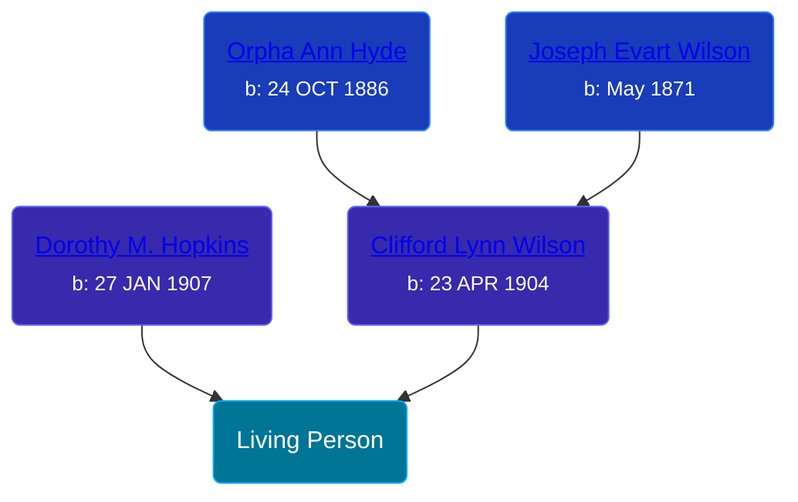

## üîµ Living Person

Son of [Clifford Lynn Wilson](/people/4/42196820) and [Dorothy M. Hopkins](/people/8/86759136)



```mermaid
graph
classDef grands fill:#193cb8,stroke:#2b7fff,stroke-width:1px,color:#fff;
classDef parents fill:#372aac,stroke:#615fff,stroke-width:1px,color:#fff;
classDef primary fill:#007595,stroke:#00a6f4,stroke-width:1px,color:#fff;
67314316(Living Person):::primary
86759136(<a class="text-white" href="/people/8/86759136">Dorothy M. Hopkins</a><br /><small>b: 27 JAN 1907</small>):::parents-->67314316
42196820(<a class="text-white" href="/people/4/42196820">Clifford Lynn Wilson</a><br /><small>b: 23 APR 1904</small>):::parents-->67314316
63932813(<a class="text-white" href="/people/6/63932813">Orpha Ann Hyde</a><br /><small>b: 24 OCT 1886</small>):::grands-->42196820
57306025(<a class="text-white" href="/people/5/57306025">Joseph Evart Wilson</a><br /><small>b: May 1871</small>):::grands-->42196820
```


## 👩‍❤️‍👨 Relationships

### 🟣 [Living Person](/people/4/47399040)
