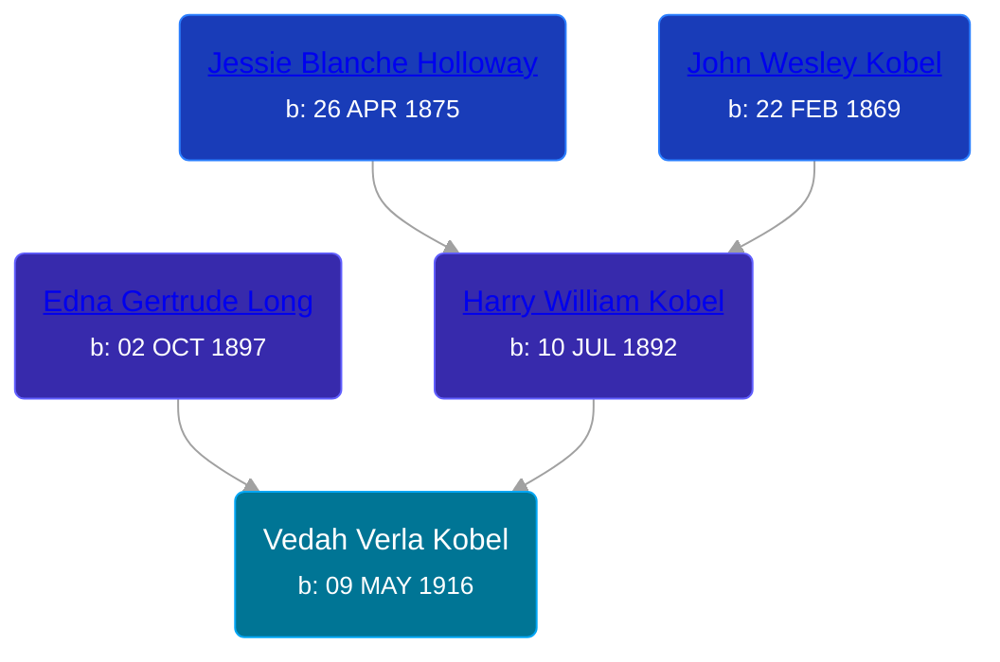

## 🟣 Vedah Verla Kobel
<small>Age: 78y, 3m, 26d</small>

Daughter of [Harry William Kobel](/people/3/30496161) and [Edna Gertrude Long](/people/3/33710863)





### 📆 Events


Type | Date | Age at Event | Place
------ | ------ | ------ | ------
[Birth](#event-event-2) | 09 MAY 1916 |  | Elmira Township, Antrim, Michigan, USA
[Residence](#event-event-0) | 08 JAN 1920 | 3y, 7m, 29d | Warner Township, Antrim, Michigan, USA
[Residence](#event-event-1) | 05 APR 1930 | 13y, 10m, 26d | Chestonia Township, Antrim, Michigan, USA
[Death](#event-event-5) | 05 SEP 1994 | 78y, 3m, 26d | Waldorf, Charles, Maryland, USA



- **[Birth](#event-event-2)**
**Date**: 09 MAY 1916, Age:
**Place**: Elmira Township, Antrim, Michigan, USA
- **[Residence](#event-event-0)**
**Date**: 08 JAN 1920, Age: 3y, 7m, 29d
**Place**: Warner Township, Antrim, Michigan, USA
- **[Residence](#event-event-1)**
**Date**: 05 APR 1930, Age: 13y, 10m, 26d
**Place**: Chestonia Township, Antrim, Michigan, USA
- **[Death](#event-event-5)**
**Date**: 05 SEP 1994, Age: 78y, 3m, 26d
**Place**: Waldorf, Charles, Maryland, USA


## 👩‍❤️‍👨 Relationships

### 🔵 [Donald Lorenzo Wilson](/people/7/72318427), b. 17 AUG 1913

#### Events


Type | Date | Age at Event | Place
------ | ------ | ------ | ------
[Marriage](#event-family-0-event-0) | 28 NOV 1933 | 17y, 6m, 19d | Alba, Antrim, Michigan, USA



- **[Marriage](#event-family-0-event-0)**
**Date**: 28 NOV 1933, Age: 17y, 6m, 19d
**Place**: Alba, Antrim, Michigan, USA


### 📰 Event Sources

####  Birth, 09 MAY 1916
* Ron Wilson's Research

####  Residence, 08 JAN 1920
* 1920 US Census
>   
  > Name: Vida Kobel  
  > Age: 3  
  > Birth Year: abt 1917  
  > Birthplace: Michigan  
  > Home in 1920: Wamer, Antrim, Michigan  
  > Residence Date: 1920  
  > Race: White  
  > Gender: Female  
  > Relation to Head of House: Daughter  
  > Marital Status: Single  
  > Father's Name: Harry Kobel  
  > Father's Birthplace: Michigan  
  > Mother's Name: Edna Kobel  
  > Mother's Birthplace: Michigan

####  Residence, 05 APR 1930
* 1930 US Census

####  Marriage, 28 NOV 1933
* Ron Wilson's Research
####  Death, 05 SEP 1994
* Ron Wilson's Research
