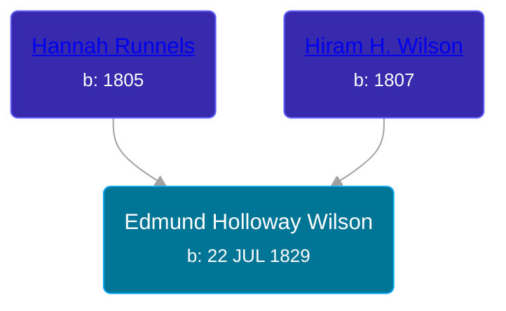

## 🔵 Edmund Holloway Wilson
<small>Age: 82y, 10m, 17d</small>

Son of [Hiram H. Wilson](/people/8/82044077) and [Hannah Runnels](/people/9/9135776)





### 📆 Events


Type | Date | Age at Event | Place
------ | ------ | ------ | ------
[Birth](#event-event-2) | 22 JUL 1829 |  | Massachusetts, USA
[Residence](#event-event-0) | 30 SEP 1850 | 21y, 2m, 8d | Savannah, Wayne, New York, USA
[Residence](#event-event-1) | 21 AUG 1860 | 31y, 29d | Butler, Wayne, New York, USA
[Residence](#event-event-2) | 04 SEP 1870 | 41y, 1m, 12d | Allendale, Ottawa, Michigan, USA
[Residence](#event-event-3) | Jun 1890 | 60y, 10m, 8d | Tyrone Township, Kent, Michigan, USA
[Residence](#event-event-4) | 1894 | 64y, 4m, 8d | Tyrone Township, Kent, Michigan, USA
[Residence](#event-event-5) | 14 JUN 1900 | 70y, 10m, 22d | Tyrone Township, Kent, Michigan, USA
[Residence](#event-event-6) | 08 MAY 1910 | 80y, 9m, 16d | Tyrone Township, Kent, Michigan, USA
[Death](#event-event-10) | 09 JUN 1912 | 82y, 10m, 17d | Kalamazoo, Kalamazoo, Michigan, USA
[Burial](#event-event-11) |  |  | Robinson Township Cemetery, Robinson Township, Ottawa, Michigan, USA



- **[Birth](#event-event-2)**
**Date**: 22 JUL 1829, Age:
**Place**: Massachusetts, USA
- **[Residence](#event-event-0)**
**Date**: 30 SEP 1850, Age: 21y, 2m, 8d
**Place**: Savannah, Wayne, New York, USA
- **[Residence](#event-event-1)**
**Date**: 21 AUG 1860, Age: 31y, 29d
**Place**: Butler, Wayne, New York, USA
- **[Residence](#event-event-2)**
**Date**: 04 SEP 1870, Age: 41y, 1m, 12d
**Place**: Allendale, Ottawa, Michigan, USA
- **[Residence](#event-event-3)**
**Date**: Jun 1890, Age: 60y, 10m, 8d
**Place**: Tyrone Township, Kent, Michigan, USA
- **[Residence](#event-event-4)**
**Date**: 1894, Age: 64y, 4m, 8d
**Place**: Tyrone Township, Kent, Michigan, USA
- **[Residence](#event-event-5)**
**Date**: 14 JUN 1900, Age: 70y, 10m, 22d
**Place**: Tyrone Township, Kent, Michigan, USA
- **[Residence](#event-event-6)**
**Date**: 08 MAY 1910, Age: 80y, 9m, 16d
**Place**: Tyrone Township, Kent, Michigan, USA
- **[Death](#event-event-10)**
**Date**: 09 JUN 1912, Age: 82y, 10m, 17d
**Place**: Kalamazoo, Kalamazoo, Michigan, USA
- **[Burial](#event-event-11)**
**Date**:
**Place**: Robinson Township Cemetery, Robinson Township, Ottawa, Michigan, USA


## 👩‍❤️‍👨 Relationships

### 🟣 [Mary Jane Conant](/people/2/27722232), b. 18 MAR 1832

#### Events


Type | Date | Age at Event | Place
------ | ------ | ------ | ------
[Marriage](#event-family-0-event-0) | 02 SEP 1849 | 20y, 1m, 10d | Savannah, Wayne, New York, USA



- **[Marriage](#event-family-0-event-0)**
**Date**: 02 SEP 1849, Age: 20y, 1m, 10d
**Place**: Savannah, Wayne, New York, USA


#### Children With Mary Jane Conant
* 🟣 [Mary Jane Wilson](/people/6/68306241), b. 1850
* 🟣 [Polly Ann Wilson](/people/9/97244328), b. abt 1853
* 🔵 [James E. Wilson](/people/5/54950695), b. 11 APR 1856
* 🟣 [Leora E. Wilson](/people/2/22233872), b. about 1867
* 🔵 [Joseph Evart Wilson](/people/5/57306025), b. May 1871
## 📝 Notes
>   
  > Edmund was a veteran of the Civil War, serving in the New York Ninth Heavy Artillery, Company M.
>   
  > Listed as Edwin in the 1850 US Census, Edmund is living with his wife Mary, and her parents Reuben and Polly.
### 📰 Event Sources

####  Birth, 22 JUL 1829
* New York, Town Clerks' Registers of Men Who Served in the Civil War, ca 1861-1865  - 16
>   
  > Name: Edmund Holloway Wilson  
  > Residence: Butler, Wayne County, New York  
  > Time & Place of Birth: July 22, 1829  
  > Present Rank: Private  
  > Present Regiment: 9  
  > Letter of Company: M  
  > Enlisted: Dec. 18, 1863  
  > Mustered: Dec 29, 1863  
  > Rank: Private   
  > Place of Enlistment: Clyde  
  > Color: White  
  > Bounty Paid: 300  
  > Marital Status: M  
  > Name of Parents: Hiram Wilson & Hannah Runnels  
  > Previous Occupation: Farmer  
  >   
  > In Battle of Cold Harbor ??? Petersburg. M[???]  
  > Winchester [sent 15?]. McClellan Hospital Philadelphia.   
  > Discharged Jul 19, 1865.

####  Residence, 30 SEP 1850
* 1850 US Census
>   
  > Name: Edwin Wilson  
  > Gender: Male  
  > Race: White  
  > Residence Age: 21  
  > Birth Date: abt 1829  
  > Birthplace: New York  
  > Residence Date: 1850  
  > Home in 1850: Savannah, Wayne, New York, USA  
  > Occupation: Laborer  
  > Industry: Industry Not Reported  
  > Line Number: 36  
  > Dwelling Number: 264  
  > Family Number: 264  
  >   
  > Household members:  
  > Reuben Conant, 47  
  > Polly Conant, 45  
  > Sally A Conant, 15  
  > Reuben S Conant, 10  
  > James Conant, 6  
  > Edwin Wilson, 21  
  > Mary Wilson, 18

####  Residence, 21 AUG 1860
* 1860 US Census
>   
  > Name: Edmund Wilson  
  > Age: 30  
  > Birth Year: abt 1830  
  > Gender: Male  
  > Race: White  
  > Birth Place: New York  
  > Home in 1860: Butler, Wayne, New York  
  > Post Office: West Butler  
  > Dwelling Number: 830  
  > Family Number: 810  
  > Occupation: Day Laborer  
  > Real Estate Value: 150  
  > Personal Estate Value: 50  
  >   
  > Household members:  
  > Edmund Wilson, 30  
  > Mary Wilson, 27  
  > Mary J Wilson, 9  
  > Polly A Wilson, 6  
  > James Wilson, 3

####  Residence, 04 SEP 1870
* 1870 US Census
>   
  > Name: Edwin Wilson  
  > Age in 1870: 41  
  > Birth Date: abt 1829  
  > Birthplace: New York  
  > Dwelling Number: 10  
  > Home in 1870: Allendale, Ottawa, Michigan  
  > Race: White  
  > Gender: Male  
  > Post Office: Holland  
  > Occupation: Farmer  
  > Male Citizen Over 21: Yes  
  > Real Estate Value: 2000  
  >   
  > Household members:  
  > Edwin Wilson, 41  
  > Mary Wilson, 37  
  > Polly Wilson, 16  
  > James Wilson, 13  
  >

####  Residence, Jun 1890
* 1890 US Census, Veterans Schedule
>   
  > Name: Edmund H Wilson  
  > Gender: Male  
  > Rank: Private  
  > Role: Veteran  
  > Residence Date: Jun 1890  
  > Residence Place: Tyrone, Kent, Michigan, USA  
  > Enumeration District: 139  
  > Enlistment Date: 18 Dec 1863  
  > Discharge Date: 27 Jul 1865  
  > Regiment or vessel: 9 New York Heavy Art  
  > Company: M  
  > Length of Service: 1 Yrs 7 Mos 9 Days

####  Residence, 1894
* 1894 Michigan State Census
>   
  > Name: Edmund Wilson  
  > Sex: Male  
  > Age: 65  
  > Residence Place: Tyrone, Kent, Michigan, United States  
  > Relationship to Head of Household: Husband  
  > Event Type: Census  
  > Event Place: Tyrone, Kent, Michigan, United States  
  > Event Place (Original): Tyrone, Kent, Michigan, United States  
  > Line Number: 16  
  > Page Number: 49  
  > Microfilm Number: 984228  
  > Indexing Batch: N04014-5  
  >   
  > Household members:  
  > Edmund Wilson, M, 65  
  > Mary Wilson, F, 62  
  > Evert J. Wilson, M, 23  
  >

####  Residence, 14 JUN 1900
* 1900 US Census
>   
  > Name: Edmond H Wilson  
  > Age: 70  
  > Birth Date: Jul 1829  
  > Birthplace: Massachusetts, USA  
  > Home in 1900: Tyrone, Kent, Michigan  
  > Sheet Number: 12  
  > Number of Dwelling in Order of Visitation: 163  
  > Family Number: 163  
  > Race: White  
  > Gender: Male  
  > Relation to Head of House: Head  
  > Marital Status: Widowed  
  > Father's Birthplace: Ireland  
  > Mother's Birthplace: New York, USA  
  > Occupation: Farmer  
  > Months Not Employed: 0  
  > Can Read: Y  
  > Can Write: N  
  > Can Speak English: Y  
  > House Owned or Rented: Own  
  > Home Free or Mortgaged: F  
  > Farm or House: F  
  >   
  > Household members:  
  >  - Edmond H Wilson, 70, Head  
  >  - Joseph E Wilson, 29, Son  
  >

####  Residence, 08 MAY 1910
* 1910 US Census
>   
  > Name: Edd Wilson  
  > Age in 1910: 81  
  > Birth Date: 1829  
  > Birthplace: New York  
  > Home in 1910: Tyrone, Kent, Michigan, USA  
  > Sheet Number: 9b  
  > Race: White  
  > Gender: Male  
  > Relation to Head of House: Father  
  > Marital Status: Widowed  
  > Father's Birthplace: New York  
  > Mother's Birthplace: New York  
  > Native Tongue: English  
  > Able to read: Y  
  > Able to Write: Y  
  > Enumeration District Number: 0142  
  > Survivor of Union or Confederate Army or Navy: Ua  
  > Enumerated Year: 1910  
  >   
  > Household members:  
  > - Joseph Nelson, 37, Head  
  > - Orpha Wilson, 24, Wife  
  > - Clifford Wilson, 6, Son  
  > - Joseph Wilson, 3, Son  
  > - Edd Wilson, 81, Father  
  >

####  Death, 09 JUN 1912
* The Grand Rapids Herald  - 1/22/1912
>   
  > Dug Graves at Night: War Veteran is Dead  
  >   
  > GRAND HAVEN, Mich., Jan 21 -- Edmund Wilson, aged 82 years, for 50 years a resident of Robinson township, died at Kalamazoo where he had made his home of late. He served in the New York heavy artillery during the Civil War. Much land in Allendale and Robinson townships was cleared by his ax. For years he served as sexton in Robinson, with scarcely any pay, digging graves by lantern light, so as not to interfere with his other work. He leaves two sons.
* Michigan, Death Records, 1867-1950
>   
  > Name: Edmund H Wilson  
  > Gender: Male  
  > Color: White  
  > Marital Status: Widowed  
  > Birth Date: Jul, 1829  
  > Birth Place: Massachusetts  
  > Death Date: 9 Jan 1912  
  > Death Place: Kalamazoo, Kalamazoo, Michigan, USA (Asylum, 3rd Ward)  
  > Death Age: 82  
  > Place of Burial: Grand Rapids  
  > Cause: Arteris sclerosis  
  > Contributing: Bronchopneumonia  
  > Father: Hiram H Wilson  
  > Birthplace: Ireland  
  > Mother: Hannah Runnell  
  > Birthplace: New York
* Michigan Veterans Home Resident Listing  - Film 57, Record M-5798
>   
  > Male Surname: Wilson  
  > Male First Name: Edmund H.  
  > Death Date: 01/09/1912  
  > Number of Pages: 5  
  > Film Number: 54
* Kalamazoo County Death Records  - Book 4, Page 100
>   
  > Name: Edmund H. WILSON  
  > Age: 82 yrs 5 mos 18 days  
  > DOD: 9 JAN 1912  
  > POD: Kalamazoo City  
  > POB: Massachussetts  
  > Occupation: Farmer  
  > Cause: Arteris sclerosis  
  > Father: Hiram H. WILSON  
  > Mother: Hannah RUNNELS

####  Burial
* Robinson Township Cemetery
####  Marriage, 02 SEP 1849
* Wayne County, New York Marriages
>   
  > Date: 02 Sep 1849  
  > Groom: Edward Wilson  
  > Residence: Savannah  
  > Age: 25  
  > Bride: Mary Conant  
  > Residence: Savannah  
  > Age: 20  
  > Official: Revd. Samuel Goff
