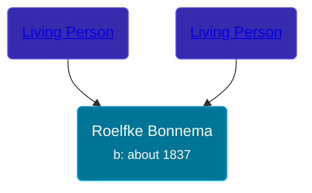

## 🟣 Roelfke Bonnema

Daughter of [Living Person](/people/9/98226424) and [Living Person](/people/8/85927182)





### 📆 Events


Type | Date | Age at Event | Place
------ | ------ | ------ | ------
Birth | about 1837 |  |



- **Birth**
**Date**: about 1837, Age:
**Place**:


## 👩‍❤️‍👨 Relationships

### 🔵 [Iebele Eintes Postma](/people/6/62935454), b. 21 JUL 1833

#### Events


Type | Date | Age at Event | Place
------ | ------ | ------ | ------
[Marriage](#event-family-0-event-0) | 26 APR 1862 | 25y, 4m, 26d | Leek, Netherlands



- **[Marriage](#event-family-0-event-0)**
**Date**: 26 APR 1862, Age: 25y, 4m, 26d
**Place**: Leek, Netherlands


### 📰 Event Sources

####  Marriage, 26 APR 1862
* Dutch Civil Register
>   
  > Groom: Iebele Eintes Postma  
  > Profession (Groom): boerenknecht  
  > Place of birth (Groom): Surhuisterveen  
  > Age (Groom): 28 jaar  
  >   
  > Bride: Roelfke Bonnema  
  > Profession (Bride): Arbeidster  
  > Place of birth (Bride): Tolbert  
  > Age (Bride): 25 jaar  
  >   
  > Father of the groom: Einte Wolters Postma  
  > Profession (Father of the groom): arbeider  
  >   
  > Mother of the groom: Riekeltje Jakobs Wagenaar  
  > Profession (Mother of the groom): Arbeidster  
  >   
  > Father of the bride: Auwe Lammerts Bonnema  
  > Profession (Father of the bride): Arbeidster  
  >   
  > Mother of the bride: Grietje Jakobs Auwema  
  >   
  > Event: Huwelijk  
  > Event date: 26-04-1862  
  > Event place: Leek  
  >   
  > Document type: BS Huwelijk  
  > Heritage institution: Groninger Archieven  
  > Institution place: Groningen  
  > Collection region: Groningen  
  > Source number: 13  
  > Registration date: 26-04-1862  
  > Document place: Leek  
  > Collection: Bron: boek, Periode: 1862  
  > Book: Huwelijksregister 1862  
  > AkteSoort: huwelijk  
  >