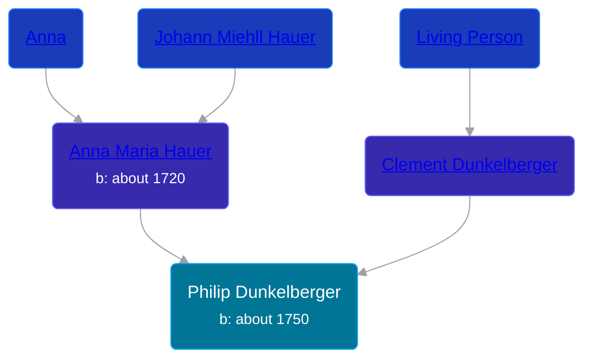

## 🔵 Philip Dunkelberger

Son of [Clement Dunkelberger](/people/1/13545057) and [Anna Maria Hauer](/people/2/22963774)





### 📆 Events


Type | Date | Age at Event | Place
------ | ------ | ------ | ------
[Birth](#event-event-2) | about 1750 |  |



- **[Birth](#event-event-2)**
**Date**: about 1750, Age:
**Place**:


## 👩‍❤️‍👨 Relationships

### 🟣 [Living Person](/people/9/95348396)

### 📰 Event Sources

####  Birth, about 1750
* The Dunkelberger Family: Europe to America, 1600-1982