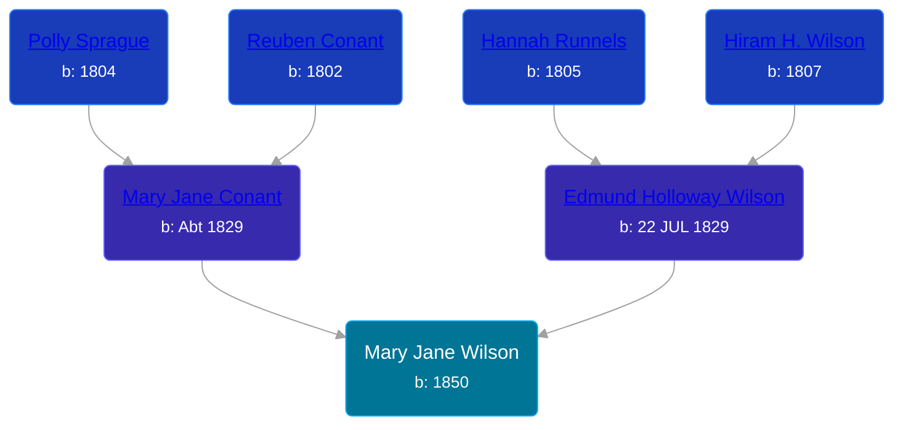

## 🟣 Mary Jane Wilson
<small>Age: 20y, 4m, 26d</small>

Daughter of [Edmund Holloway Wilson](/people/6/67777324) and [Mary Jane Conant](/people/2/27722232)





### 📆 Events


Type | Date | Age at Event | Place
------ | ------ | ------ | ------
Birth | 1850 |  | New York, USA
[Residence](#event-event-0) | 1860 | 10y | Butler, Wayne, New York, USA
[Death](#event-event-4) | 26 APR 1870 | 20y, 4m, 26d | Allendale, Ottawa, Michigan, USA



- **Birth**
**Date**: 1850, Age:
**Place**: New York, USA
- **[Residence](#event-event-0)**
**Date**: 1860, Age: 10y
**Place**: Butler, Wayne, New York, USA
- **[Death](#event-event-4)**
**Date**: 26 APR 1870, Age: 20y, 4m, 26d
**Place**: Allendale, Ottawa, Michigan, USA


### 📰 Event Sources

####  Residence, 1860
* 1860 US Census

####  Death, 26 APR 1870
* Michigan, Deaths and Burials Index, 1867-1995
>   
  > Name: Mary J. Wilson  
  > Birth Date: abt 1850  
  > Birth Place: New York  
  > Death Date: 26 Apr 1869  
  > Death Place: Allendale, Ottawa, Mich.  
  > Death Age: 19  
  > Race: White  
  > Marital Status: Single  
  > Gender: Female  
  > Father Name: Edmond Wilson  
  > Mother Name: Mary J. Wilson  
  > FHL Film Number: 984237
* Ottawa County, Michigan, Death Index, 1867-1901
>   
  > Name:Mary J. Wilson  
  > Gender:Female  
  > Death Age:19  
  > Birth Date:abt 1851  
  > Birth Place:New York, USA  
  > Death Date:24 Apr 1870  
  > Death Place:Allendale, Ottawa, Michigan, USA  
  > Father Name:Edmund Wilson  
  > Mother Name:Mary J.
* U.S. Federal Census Mortality Schedules, 1850-1885
>   
  > Name: Mary J Wilson  
  > Gender: Female  
  > Race: White  
  > Estimated birth year: abt 1851  
  > Birth Place: New York, USA  
  > Age: 19  
  > Death Date: Apr 1870  
  > Cause of Death: Scarlet Fever  
  > Census Year: 1870  
  > Census Place: Allendale, Ottawa, Michigan  
  > LINE: 1
