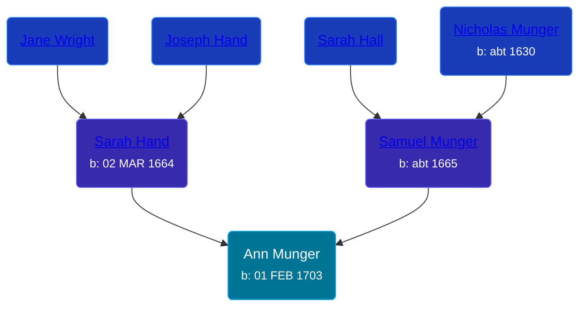

## 🟣 Ann Munger
<small>Age: 48y, 8m, 16d</small>

Daughter of [Samuel Munger](/people/5/57362828) and [Sarah Hand](/people/7/75255100)





### 📆 Events


Type | Date | Age at Event | Place
------ | ------ | ------ | ------
[Birth](#event-event-2) | 01 FEB 1703 |  | Guilford, Connecticut, USA
[Death](#event-event-3) | 17 OCT 1751 | 48y, 8m, 16d |



- **[Birth](#event-event-2)**
**Date**: 01 FEB 1703, Age:
**Place**: Guilford, Connecticut, USA
- **[Death](#event-event-3)**
**Date**: 17 OCT 1751, Age: 48y, 8m, 16d
**Place**:


### 📰 Event Sources

####  Birth, 01 FEB 1703
* The Munger Book  - 203

####  Death, 17 OCT 1751
* The Munger Book  - 203