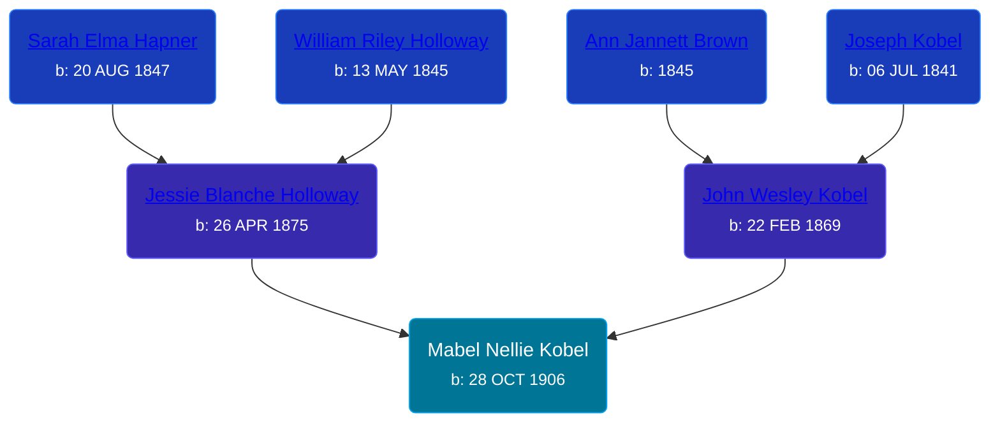

## 🟣 Mabel Nellie Kobel
<small>Age: 51y, 1m, 2d</small>

Daughter of [John Wesley Kobel](/people/2/24649136) and [Jessie Blanche Holloway](/people/2/29242864)





### 📆 Events


Type | Date | Age at Event | Place
------ | ------ | ------ | ------
Birth | 28 OCT 1906 |  | Elmira Township, Antrim, Michigan, USA
[Residence](#event-event-0) | 15 APR 1910 | 3y, 5m, 17d | Warner Township, Antrim, Michigan, USA
[Residence](#event-event-1) | 05 JAN 1920 | 13y, 2m, 7d | Warner Township, Antrim, Michigan, USA
[Residence](#event-event-2) | 05 MAY 1930 | 23y, 6m, 7d | Wyoming Township, Kent, Michigan, USA
Death | 1958 | 51y, 1m, 2d |



- **Birth**
**Date**: 28 OCT 1906, Age:
**Place**: Elmira Township, Antrim, Michigan, USA
- **[Residence](#event-event-0)**
**Date**: 15 APR 1910, Age: 3y, 5m, 17d
**Place**: Warner Township, Antrim, Michigan, USA
- **[Residence](#event-event-1)**
**Date**: 05 JAN 1920, Age: 13y, 2m, 7d
**Place**: Warner Township, Antrim, Michigan, USA
- **[Residence](#event-event-2)**
**Date**: 05 MAY 1930, Age: 23y, 6m, 7d
**Place**: Wyoming Township, Kent, Michigan, USA
- **Death**
**Date**: 1958, Age: 51y, 1m, 2d
**Place**:


## 👩‍❤️‍👨 Relationships

### 🔵 [Albert Mekkes](/people/8/86238917), b. about 1902

#### Children With Albert Mekkes
* 🔵 [Living Person](/people/7/73461912)
* 🟣 [Living Person](/people/5/5629368)
### 📰 Event Sources

####  Residence, 15 APR 1910
* 1910 US Census

####  Residence, 05 JAN 1920
* 1920 US Census

####  Residence, 05 MAY 1930
* 1930 US Census
