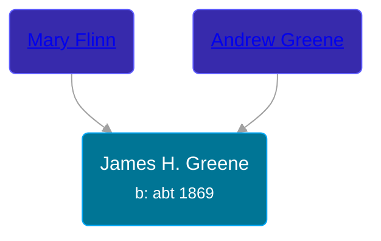

## 🔵 James H. Greene

Son of [Andrew Greene](/people/7/70089858) and [Mary Flinn](/people/9/95328054)





### 📆 Events


Type | Date | Age at Event | Place
------ | ------ | ------ | ------
Birth | abt 1869 |  |



- **Birth**
**Date**: abt 1869, Age:
**Place**:


## 👩‍❤️‍👨 Relationships

### 🟣 [Teressa Heinlein](/people/8/82695634), b. abt 1873

#### Events


Type | Date | Age at Event | Place
------ | ------ | ------ | ------
[Marriage](#event-family-0-event-0) | 07 SEP 1897 | 28y, 9m, 7d | Saginaw, Saginaw, Michigan, USA



- **[Marriage](#event-family-0-event-0)**
**Date**: 07 SEP 1897, Age: 28y, 9m, 7d
**Place**: Saginaw, Saginaw, Michigan, USA


### 📰 Event Sources

####  Marriage, 07 SEP 1897
* Michigan, U.S., County Marriage Records, 1822-1940
>
  > Name: James H. Greene
  > Gender: Male
  > Age: 28
  > Birth Date: abt 1869
  > Marriage Date: 7 Sep 1897
  > Marriage Place: Saginaw, Michigan, USA
  > Father: Andrew Greene
  > Mother: Flynn
  > Spouse: Teressa Heinlein
  > Spouse Gender: Female
  > Spouse Age: 24
  > Spouse Birth Date: abt 1873
  > Spouse Father: Wolfgang Heinlein
  > Film Number: 000967190
