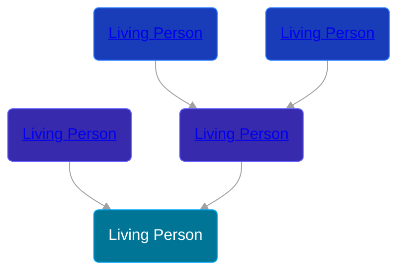

## 🔵 Living Person

Son of [Living Person](/people/5/54906750) and [Living Person](/people/2/28950416)



```mermaid
graph
classDef grands fill:#193cb8,stroke:#2b7fff,stroke-width:1px,color:#fff;
classDef parents fill:#372aac,stroke:#615fff,stroke-width:1px,color:#fff;
classDef primary fill:#007595,stroke:#00a6f4,stroke-width:1px,color:#fff;
69350741(Living Person):::primary
28950416(<a class="text-white" href="/people/2/28950416">Living Person</a>):::parents-->69350741
54906750(<a class="text-white" href="/people/5/54906750">Living Person</a>):::parents-->69350741
47560746(<a class="text-white" href="/people/4/47560746">Living Person</a>):::grands-->54906750
89027494(<a class="text-white" href="/people/8/89027494">Living Person</a>):::grands-->54906750
linkStyle default stroke:#a1a1a1
```

