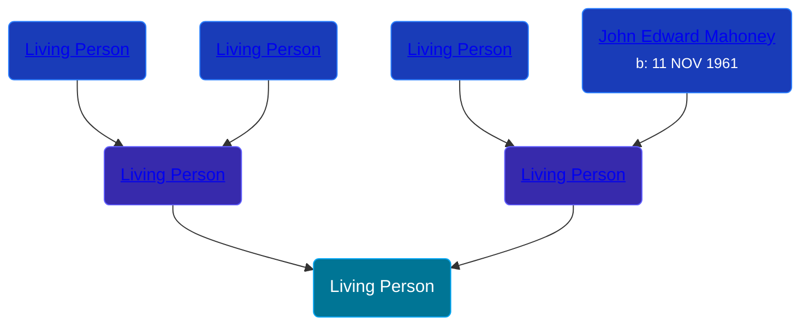

## 🟣 Living Person

Daughter of [Living Person](/people/4/4287670) and [Living Person](/people/5/56446490)



```mermaid
graph
classDef grands fill:#193cb8,stroke:#2b7fff,stroke-width:1px,color:#fff;
classDef parents fill:#372aac,stroke:#615fff,stroke-width:1px,color:#fff;
classDef primary fill:#007595,stroke:#00a6f4,stroke-width:1px,color:#fff;
70456546(Living Person):::primary
56446490(<a class="text-white" href="/people/5/56446490">Living Person</a>):::parents-->70456546
19693317(<a class="text-white" href="/people/1/19693317">Living Person</a>):::grands-->56446490
34056238(<a class="text-white" href="/people/3/34056238">Living Person</a>):::grands-->56446490
4287670(<a class="text-white" href="/people/4/4287670">Living Person</a>):::parents-->70456546
92555368(<a class="text-white" href="/people/9/92555368">Living Person</a>):::grands-->4287670
20318131(<a class="text-white" href="/people/2/20318131">John Edward Mahoney</a><br /><small>b: 11 NOV 1961</small>):::grands-->4287670
```

