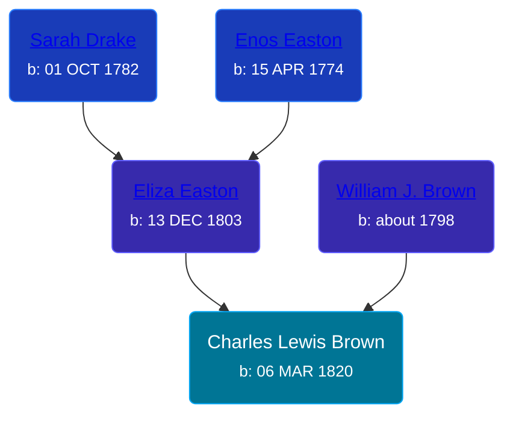

## 🔵 Charles Lewis Brown
<small>Age: 79y, 9m, 3d</small>

Son of [William J. Brown](/people/3/37180394) and [Eliza Easton](/people/2/29447626)





### 📆 Events


Type | Date | Age at Event | Place
------ | ------ | ------ | ------
Birth | 06 MAR 1820 |  | Rochester, Monroe, New York, USA
[Residence](#event-event-0) | 1860 | 39y, 8m, 24d | Bushnell, Montcalm, Michigan, USA
[Residence](#event-event-1) | 1870 | 49y, 8m, 24d | Union Township, Isabella, Michigan, USA
[Residence](#event-event-2) | 1880 | 59y, 8m, 24d | Union Township, Isabella, Michigan, USA
[Death](#event-event-6) | 09 DEC 1899 | 79y, 9m, 3d | Clare, Clare County, Michigan, United States
Burial |  |  | Cherry Grove Cemetery, Clare, Clare County, Michigan, United States



- **Birth**
**Date**: 06 MAR 1820, Age:
**Place**: Rochester, Monroe, New York, USA
- **[Residence](#event-event-0)**
**Date**: 1860, Age: 39y, 8m, 24d
**Place**: Bushnell, Montcalm, Michigan, USA
- **[Residence](#event-event-1)**
**Date**: 1870, Age: 49y, 8m, 24d
**Place**: Union Township, Isabella, Michigan, USA
- **[Residence](#event-event-2)**
**Date**: 1880, Age: 59y, 8m, 24d
**Place**: Union Township, Isabella, Michigan, USA
- **[Death](#event-event-6)**
**Date**: 09 DEC 1899, Age: 79y, 9m, 3d
**Place**: Clare, Clare County, Michigan, United States
- **Burial**
**Date**:
**Place**: Cherry Grove Cemetery, Clare, Clare County, Michigan, United States


## 👩‍❤️‍👨 Relationships

### 🟣 [Sarah Irene Evans](/people/4/47294572), b. 10 MAR 1822

#### Events


Type | Date | Age at Event | Place
------ | ------ | ------ | ------
[Marriage](#event-family-0-event-0) |  |  |



- **[Marriage](#event-family-0-event-0)**
**Date**:
**Place**:


#### Children With Sarah Irene Evans
* 🟣 [Ann Jannett Brown](/people/2/25015094), b. 1845
* 🔵 [Marcus DeLafette Brown](/people/2/29740424), b. 24 AUG 1847
* 🟣 [Adeline Marion Brown](/people/3/37233677), b. 24 FEB 1849
* 🔵 [Hiram Severan Brown](/people/3/38517880), b. 24 AUG 1851
* 🔵 [Silas Metcalf Brown](/people/4/4863792), b. 19 JUN 1853
* 🟣 [Elizabeth Maria Brown](/people/2/23463647), b. abt 1855
* 🟣 [Almira M. Brown](/people/9/94983272), b. abt 1859
* 🟣 [Lois D. Brown](/people/2/28589166), b. abt 1862
* 🟣 [Agnes Viola Brown](/people/1/12576553), b. abt 1864
* 🟣 [Elnora Brown](/people/9/92661304), b. abt 1866
* 🔵 [Enos Lester Brown](/people/8/88491302), b. 22 DEC 1868
### 📰 Event Sources

####  Residence, 1860
* 1860 US Census

####  Residence, 1870
* 1870 US Census

####  Residence, 1880
* 1880 US Census

####  Death, 09 DEC 1899
* The Clare Sentinel
>   
  > Last Saturday, after several days intense suffering. Charles Lewis Brown passed from this life at the advanced age of eighty years, hemea being the immediate cause of his death. Mr. Brown was born in Rachester, N.Y., March 6,1820, and was a member of a family of ten children. Until his 24th year he lived with his parents, at this age marring Miss Sarah Irene Evens, who with four sons and four daughters survive him, three daughters having died, About 1843 he moved his family to lonia county, and some twenty years later moved to Mt. Pleasant. Seven years ago they came to Clara which has since been their home.  
  > The funeral was conducted from the Congregational Church Tuesday morning. Rev. Terry of the Adventists Church officiating, and the remains were inferred in Cherry Grove Cemetery.  
  > The Sentinel Units with their friends in offering this expression of sympathy.
* Michigan, Deaths and Burials Index, 1867-1995
>   
  > Name:Charles L. Brown  
  > Birth Date:abt 1820  
  > Birth Place:York State  
  > Death Date:9 Dec 1899  
  > Death Place:Clare, Clare, Michigan  
  > Death Age:79  
  > Occupation:Farmer  
  > Race:White  
  > Marital Status:Married  
  > Gender:Male  
  > FHL Film Number:1003308

####  Marriage
* U.S. and International Marriage Records, 1560-1900
>   
  > Name:Charles L Brown  
  > Gender:Male  
  > Birth Place:NY  
  > Birth Year:1820  
  > Spouse Name:Sarah Evans  
  > Spouse  
  > Birth Place:NY  
  > Spouse Birth Year:1822  
  > Number Pages:1
