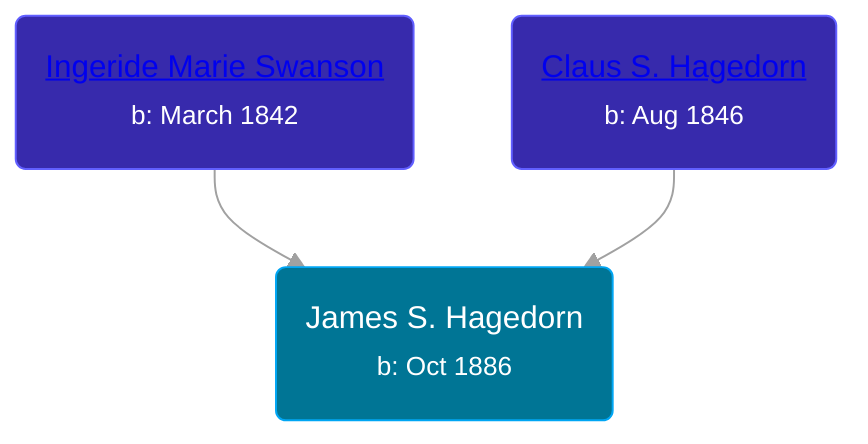

## 🔵 James S. Hagedorn
<small>Age: 82y, 2m</small>

Son of [Claus S. Hagedorn](/people/8/89695136) and [Ingeride Marie Swanson](/people/4/41786466)





### 📆 Events


Type | Date | Age at Event | Place
------ | ------ | ------ | ------
Birth | Oct 1886 |  | Germany
[Immigration](#event-event-0) | 1897 | 10y, 2m | USA
[Residence](#event-event-1) | 15 APR 1910 | 23y, 6m, 15d | Douglas, Clay, Iowa, USA
Death | 1969 | 82y, 2m |
[Burial](#event-event-6) |  |  | Willow Creek Cemetery, Clay, Iowa, USA



- **Birth**
**Date**: Oct 1886, Age:
**Place**: Germany
- **[Immigration](#event-event-0)**
**Date**: 1897, Age: 10y, 2m
**Place**: USA
- **[Residence](#event-event-1)**
**Date**: 15 APR 1910, Age: 23y, 6m, 15d
**Place**: Douglas, Clay, Iowa, USA
- **Death**
**Date**: 1969, Age: 82y, 2m
**Place**:
- **[Burial](#event-event-6)**
**Date**:
**Place**: Willow Creek Cemetery, Clay, Iowa, USA


## 👩‍❤️‍👨 Relationships

### 🟣 [Mary ](/people/7/77211374), b. 1894

### 📰 Event Sources

####  Immigration, 1897
* 1900 US Census

####  Residence, 15 APR 1910
* 1910 US Census

####  Burial
* Iowa Gravestone Project
