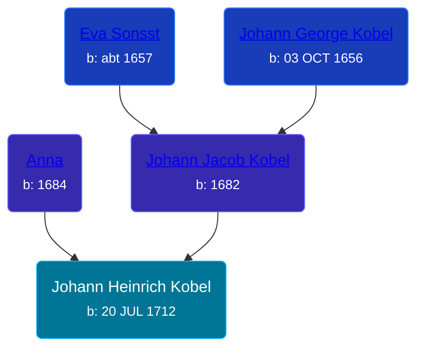

## 🔵 Johann Heinrich Kobel
<small>Age: 43y, 3m, 26d</small>

Son of [Johann Jacob Kobel](/people/8/81342340) and [Anna ](/people/4/45457809)





### 📆 Events


Type | Date | Age at Event | Place
------ | ------ | ------ | ------
Birth | 20 JUL 1712 |  | Hunterstown Camp, Livingston Manor, Albany, New York, USA
Death | 16 NOV 1755 | 43y, 3m, 26d | Tulpehocken Valley, Bethel Township, Berks, Pennsylvania, USA



- **Birth**
**Date**: 20 JUL 1712, Age:
**Place**: Hunterstown Camp, Livingston Manor, Albany, New York, USA
- **Death**
**Date**: 16 NOV 1755, Age: 43y, 3m, 26d
**Place**: Tulpehocken Valley, Bethel Township, Berks, Pennsylvania, USA


## 👩‍❤️‍👨 Relationships

### 🟣 [Maria Salome Hoffman](/people/5/59188360), b. 1713

#### Children With Maria Salome Hoffman
* 🔵 [Johann Heinrich Kobel](/people/6/65601892), b. 1741